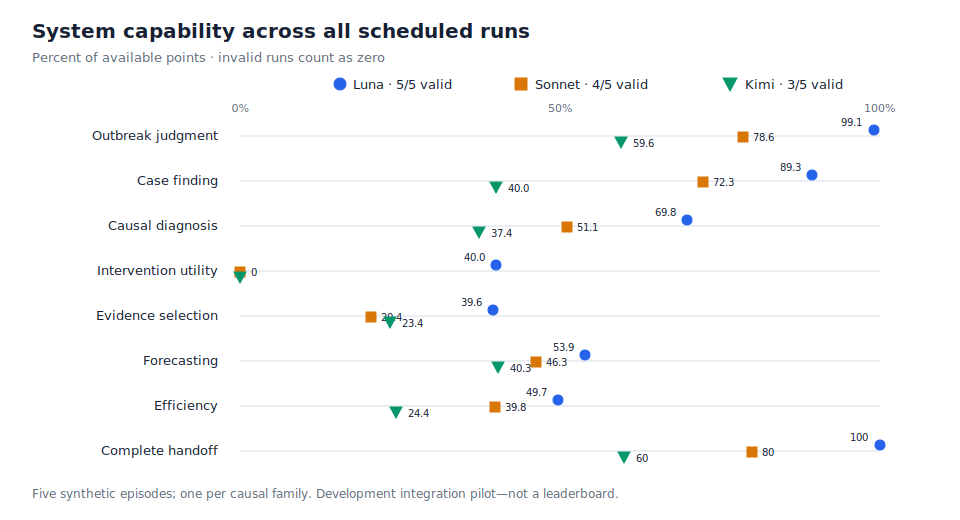

# EpiAgentBench

[](https://github.com/matthew-zhao/epiagentbench/actions/workflows/ci.yml)

EpiAgentBench is a benchmark concept and runnable reference implementation for
testing AI agents on **alert verification and initial outbreak investigation**.

An episode begins with a noisy surveillance alert. The agent must use a limited
budget and simulated time to determine whether the alert represents a true
outbreak, build a defensible line list, investigate competing explanations, and
recommend a proportionate action supported by evidence.

This stage was selected because it combines:

- high public-health impact;
- genuine multi-step investigation and tool use;
- deterministic synthetic ground truth; and
- meaningful opportunities to test reward hacking, privacy, and unsafe action.

The initial scenario pack focuses on foodborne and gastrointestinal events. The
same interface can later support respiratory, healthcare-associated, zoonotic,
and unknown-disease events.

## Implementation status

The repository now contains a working **reference process boundary**. A fresh
evaluator process owns the private seed, scenario family, oracle, unreleased
observations and schedule, action ledger, and scorer. An evaluated agent receives
only a small client that exchanges JSON messages over a connected Unix-domain
socket.

Secure launches also generate a fresh evaluator-private presentation key. Opaque
episode, person, site, report, and observation identifiers are HMAC-derived from
that key rather than from the latent simulator seed, so replaying the same
hidden seed does not reproduce public identifiers. In live Starsim episodes the
same secret also keys independent growth, simulator, and observation streams,
so enumerable development seed numbers cannot be matched to a public trajectory.
The transparent legacy demo uses a deterministic development key only for
reproducibility. A trusted harness may supply and privately retain an
`episode_secret` for exact evaluator replay; it must never place that secret in
the agent container or public trace.

Two capabilities are deliberately separate:

- `SecureEpisodeSession` is evaluator/admin-only. It owns the spawned process
  and the private channel used to score or shut down an episode. Never pass it
  to an agent.
- `epiagentbench_client.InvestigationClient` is the public agent capability. It
  can call the allow-listed investigation operations, but it cannot score an
  episode or retrieve simulator, oracle, seed, family, future-record, or scorer
  state.

The broker accepts JSON only, validates exact request shapes, serializes public
results through explicit field allow-lists, and returns generic rejection
errors. In the container runner, bounded stdout and stderr are streamed back to
the oracle-owning process for canary scanning before scoring; raw stderr is not
returned in the evaluation result. Python object privacy is not treated as the
security boundary.

The repository also includes a Linux/Docker reference runner. It exposes the
public broker as a permission-restricted Unix socket, mounts only that socket
and the agent entry script, and runs the agent non-root with no network, a
read-only root, dropped capabilities, `no-new-privileges`, an ephemeral scratch
tmpfs, and CPU/memory/PID/time/output limits. Each run starts fresh; no container
or VM snapshot is restored. The two Dockerfiles deliberately
separate the client-only agent image from the evaluator/Starsim image.

This is **not yet a production-hermetic benchmark claim**. The `secure-demo`
runs both processes on the same host and from the same source installation. The
Docker runner is Linux-only and was not exercised on this macOS development
host. Digest-pinned execution plans (the artifact format retains the legacy
`snapshot` name) and authenticated run receipts are now implemented, but the
inference proxy, independently attested runtime state, and
full hostile-container red-team suite are not.

## What is here

- [`docs/BENCHMARK_SPEC.md`](docs/BENCHMARK_SPEC.md): benchmark design,
  scenario families, scoring, sandbox boundary, and threat model.
- [`docs/SCIENTIFIC_VALIDATION.md`](docs/SCIENTIFIC_VALIDATION.md): frozen
  seed-panel results, parameter interpretation, and scientific stop-claims.
- [`docs/CALIBRATION_PROTOCOL.md`](docs/CALIBRATION_PROTOCOL.md): exact CDC
  snapshot, leakage-safe temporal splits, gate-free Starsim fitting, private
  cohort commitments, adversarial audits, and hardening gates.
- [`docs/SCIENTIFIC_V3_PROTOCOL.md`](docs/SCIENTIFIC_V3_PROTOCOL.md): the
  LTC-specific intended use, observation/transmission/action evidence contract,
  uncertainty workflow, and non-authoritative local readiness checklist now
  under development.
- [`docs/OPERATIONAL_DATA_REQUEST.md`](docs/OPERATIONAL_DATA_REQUEST.md): the
  privacy-preserving facility and health-department data needed to validate
  alerts, reporting, investigations, and actions that NORS cannot identify.
- [`docs/HUMAN_EVALUATION_PROTOCOL.md`](docs/HUMAN_EVALUATION_PROTOCOL.md): the
  expert solveability, independent adjudication, and construct-validity study
  scaffold; no participant study has yet been run.
- [`src/epiagentbench/nors_ltc_observation.py`](src/epiagentbench/nors_ltc_observation.py):
  a hash-reporting LTC-only adapter for caller-supplied NORS-shaped data. It
  describes reported outbreaks, not hidden infections, and explicitly refuses
  scientific admissibility until a custodian verifies source provenance.
- [`src/epiagentbench/cms_nh_morphology.py`](src/epiagentbench/cms_nh_morphology.py):
  a trusted/offline, development-only CMS facility-margin adapter for beds,
  census, staffing, and turnover. It emits no facility identities, rejects
  public data relabeled as a holdout, and is not yet admissible for simulation
  conditioning or episode generation; ward/contact structure remains
  unidentifiable from this source.
- [`src/epiagentbench/trusted/starsim_ltc_v3.py`](src/epiagentbench/trusted/starsim_ltc_v3.py):
  a trusted-only role/ward/static-contact-topology Starsim foundation with
  explicit placeholder evidence labels and intervention hooks. The engine is
  now available through the secure `starsim-ltc-v3` backend; temporal trace
  contacts are still aggregated to a static graph rather than applied as
  time-varying transmission doses.
- [`src/epiagentbench/trusted/ltc_closed_loop.py`](src/epiagentbench/trusted/ltc_closed_loop.py):
  the evaluator-only active/no-action adapter that turns LTC engine infections
  and simulator-derived symptoms into the existing surveillance interface,
  exposes pseudonymous roles/wards, and routes the three biological controls
  to their matching engine mechanisms. Staff exclusion and environmental
  cleaning hooks remain intentionally unexposed. Its numeric development
  defaults are public placeholders, not secret calibrated production values.
- [`src/epiagentbench/trusted/institution_traces.py`](src/epiagentbench/trusted/institution_traces.py):
  deterministic private development records for rooms, wards, shifts, meals,
  outside entries, contacts, and trace-derived interviews/inspections. It has
  no causal-mode input and is not yet calibrated to operational facility data.
- [`src/epiagentbench/trusted/intervention_evaluation.py`](src/epiagentbench/trusted/intervention_evaluation.py):
  vector outcomes, paired uncertainty draws, stakeholder-weight sensitivity,
  tail harms, regret, negative controls, and dose-response checks.
- [`src/epiagentbench/trusted/branching_manifest.py`](src/epiagentbench/trusted/branching_manifest.py):
  a legacy development-only caller-attested digest contract. It cannot prove
  simulator execution or shared opening states and must not award benchmark
  credit.
- [`src/epiagentbench/trusted/ltc_branching.py`](src/epiagentbench/trusted/ltc_branching.py):
  the trusted counterfactual path. It freezes private inputs, derives opening
  hashes by replaying Starsim, permits only frozen policies, derives outcomes
  internally, authenticates branch receipts with HMAC, and rejects raw or
  incomplete outcome panels.
- [`schemas/`](schemas): public episode and structured-submission schemas.
- [`src/epiagentbench/`](src/epiagentbench): trusted episode generation,
  controller, evaluator service, deterministic scorer, and development baseline.
- [`src/epiagentbench_client/`](src/epiagentbench_client): the small public
  investigator client intended for the untrusted agent side.
- [`docker/`](docker): separate client-only agent and trusted evaluator image
  definitions.
- [`tests/`](tests): unit tests for scoring, provenance, and safety gates.

The original in-process environment remains available as a transparent
development fixture. It is not safe for an untrusted agent because it contains
all episode observations in Python memory.

The scientific-v3 components above are development foundations, not a fitted
or externally validated episode pack. They are intentionally not the production
default. Small files under [`tests/fixtures/`](tests/fixtures/) test parsers;
their [provenance note](tests/fixtures/README.md) says which values are synthetic
and which are a public three-row CMS projection.

## Run the secure reference demo

```bash
PYTHONPATH=src python3 -m epiagentbench.cli secure-demo --seed 7
PYTHONPATH=src python3 -m epiagentbench.cli secure-demo --seed 7 --backend starsim-ltc-v3 --family institution_person_to_person
```

This launches a separate evaluator process, runs the scripted investigator
through the public JSON broker, and sends the final submission through the
separate admin/scoring capability. Its output intentionally contains no
development truth. The second command selects the role-aware long-term-care
development backend and therefore requires the pinned Starsim dependency.

The legacy, inspectable development path and the test suite are:

```bash
PYTHONPATH=src python3 -m epiagentbench.cli demo --seed 7
PYTHONPATH=src python3 -m unittest discover -s tests -v
```

Core scores are programmatic; an LLM judge is not used for leaderboard results.

## Run the development-only agent pilot

The repository includes a public stdio MCP bridge and a deliberately
non-hermetic pilot for locally authenticated cloud-agent CLIs. It currently
pins these full-system pairings:

- Codex CLI with `gpt-5.6-sol`;
- Claude Code with `claude-fable-5`; and
- Cursor Agent with its native `glm-5.2-high` alias.

Run one system or replay one private episode across all three:

```bash
PYTHONPATH=src python3 examples/run_cli_pilot.py codex --seed 1000
PYTHONPATH=src python3 examples/run_cli_pilot.py all --seed 1001
```

Each invocation creates a fresh workspace containing only the public client,
task prompt, schema, and MCP configuration. The private Starsim process and
scorer remain behind the episode socket. Paired runs reuse an evaluator-private
episode secret but never expose it to the agent. The runner records requested
and provider-reported model names, rejects a detected model fallback, rejects
Cursor attempts to use anything outside the exact public MCP allowlist, and
submits output to the strict benchmark validator after the CLI exits.

Single local invocations remain integration smokes, not publishable
comparisons. The CLIs still run on the development host and need provider
network access; the current Linux container runner has no network and cannot
host them unchanged. In particular, Claude Code may route life-science requests
from Fable to another Claude model; the pilot treats that as a failed Fable
attribution rather than silently scoring it. See
[`docs/SCIENTIFIC_VALIDATION.md`](docs/SCIENTIFIC_VALIDATION.md) for the dated
smoke results and remaining gates.

### Trace-enabled 50-episode, six-profile matched panel

The v2 precommitted comparison is preserved for audit, but its one-shot
[environment preflight failed at the first Cursor profile](results/development-matched-50x6-v2.preflight.json)
after four unscored Claude/Codex checks passed; no production episode was
consumed. The frozen receipt distinguishes a Cursor startup/authentication/
routing failure from an episode result, but deliberately retains too little
provider output to separate a bad credential from an unavailable alias or MCP
startup failure. V2 is therefore
[superseded](results/development-matched-50x6-v2.superseded.json), never reset or
replayed. The replacement
[v3 precommitment](results/development-matched-50x6-v3.manifest.json) was then
[superseded before any provider call](results/development-matched-50x6-v3.superseded.json):
an isolation audit proved its disposable Claude credential namespace would
require repeated interactive gateway authorization. A v4 preflight invocation
then aborted during local contract validation, before the provider loop, because
three frozen Glean authentication dependencies had drifted after precommit: the
helper changed from 0.0.30 to 0.0.31, the gateway-token wrapper changed from a
regular file to a symbolic link, and the managed-settings hash changed. The
[v4 manifest](results/development-matched-50x6-v4.manifest.json) and
[supersession record](results/development-matched-50x6-v4.superseded.json) are
preserved for audit. The authenticated private audit confirms zero preflight
provider calls, zero production assignments, and unchanged `prepared` /
preflight-`required` state.

The [v5 replacement](results/development-matched-50x6-v5.manifest.json) used a
fresh cohort, authentication key, private schedule, and pinned gateway wrapper.
Its one-shot [preflight](results/development-matched-50x6-v5.preflight.json)
recorded one attempt at the first Claude profile and failed credential
attestation after about 179 seconds. V5 did not yet have a durable
provider-invocation submarker, so the receipt cannot prove that a model call
returned; the control flow and elapsed time are consistent with one call and it
is conservatively treated as chargeable. No profile passed, no score was
reported, and no production assignment started. V5 is preserved and
[superseded](results/development-matched-50x6-v5.superseded.json), not reset or
retried.

The [v6 replacement](results/development-matched-50x6-v6.manifest.json) used
another fresh cohort, authentication key, private schedule, managed-Glean
credential namespace, and independent Codex credential namespace. Its one-shot
[preflight](results/development-matched-50x6-v6.preflight.json) failed during
the no-model Codex authentication bootstrap, before any model profile or
production assignment. Codex 0.144.3 clears `$CODEX_HOME/auth.json` before
browser OAuth. That removed v6's precreated evaluator symlink, so even a
successful login could write only inside its disposable home; the committed
external credential target remained empty. The retained receipt cannot
distinguish an upstream OAuth error from post-login attestation, because both
streams and the disposable login log were intentionally destroyed.
The bootstrap therefore could not establish the required external credential
postcondition. V6 is preserved and
[superseded](results/development-matched-50x6-v6.superseded.json), not reset or
retried. Its authenticated state and public receipt record zero model-bearing
calls, zero chargeable calls, and zero production assignments. The receipt says
the Glean bootstrap was `started` because both labels were eagerly initialized;
control flow proves Glean was never invoked, and v7 records each bootstrap state
only when that helper is actually launched.

The v7 replacement uses another fresh set of those private artifacts. Its
comparison contains 50 newly frozen `starsim-ltc-v3` episodes—10 from each
causal family—and the same six full agent+model profiles on every episode:

- Codex + GPT-5.6 Sol (medium)
- Codex + GPT-5.6 Luna (medium)
- Claude + Opus 4.8 (high)
- Claude + Sonnet 5 (high)
- Cursor + Grok 4.5 High
- Cursor + Kimi K2.7 Code

V7's one-shot [preflight](results/development-matched-50x6-v7.preflight.json)
passed both no-model authentication bootstraps and the Opus, Sonnet, and Codex
Sol handshakes. Codex Luna then reached the frozen 900-second provider timeout
and failed the provider contract. The two Cursor profiles were never invoked.
The receipt conservatively counts four potentially chargeable provider calls,
reports no scores, and records zero production episodes; no assignment in the
300-run panel started. V7 is retained and
[superseded](results/development-matched-50x6-v7.superseded.json) as a failed,
non-retryable historical preflight rather than reset or resumed.

The [v8 public precommitment](results/development-matched-50x6-v8.manifest.json)
uses a fresh cohort, authentication key, private schedule, managed-Glean
credential namespace, and Codex credential namespace. Its six profiles
preserve the v7 order while making the requested Codex reasoning settings
explicit:

- Claude + Opus 4.8 (high)
- Claude + Sonnet 5 (high)
- Codex + GPT-5.6 Sol (medium)
- Codex + GPT-5.6 Luna (max)
- Cursor + Grok 4.5 High
- Cursor + Kimi K2.7 Code

V8 freezes one uniform 1,800-second limit for every preflight and production
call. It records only bounded, content-free progress buckets and an
evaluator-owned terminal tool-activity count; provider text and identifiers are
never telemetry. A cleanly contained ordinary profile failure is retained and
the unscored preflight continues to later independent profiles. A Codex timeout
quarantines that panel's Codex credential namespace and skips any later Codex
profile, but later independent Cursor or Claude checks may continue. Secret
leakage, credential drift, evaluator drift, or failure to prove process and
pipe cleanup still aborts globally. Production remains locked unless all six
profiles pass.

V8's six-call [preflight](results/development-matched-50x6-v8.preflight.json)
did pass, and its committed receipt unlocked production. Production then
exposed exactly three assignments: Claude Sonnet High and Cursor Kimi K2.7 Code
returned, while Codex Luna Max was durably started before the interactive task's
foreground evaluator process disappeared. The trace-free public
[stopped watermark](results/development-matched-50x6-v8.json) records two
completed assignments and one transport void, but releases no result, score, or
trace. V8 is preserved and
[superseded](results/development-matched-50x6-v8.superseded.json) with terminal
execution and conservative Codex-authentication incidents; it cannot be reset,
retried, or mixed into a replacement estimand.

The replacement execution design is specified in the
[persistent runner protocol](docs/PERSISTENT_RUNNER_PROTOCOL.md). V9 runs as a
finite user LaunchAgent under `caffeinate`, independent of a Codex task,
terminal, PTY, or desktop-app turn. Its owner-only config, worker status,
supervisor lease, and bounded hash-chain log are authenticated; the Cursor key
is read from macOS Keychain only inside the worker and is never placed in the
plist or command line. A scheduled chat heartbeat may observe authenticated
liveness, but it cannot own, restart, or boot out the job. Offline gates now
include a 300-command at-most-once soak and a real fake-only launchd test in
which the initiating process exits while the authenticated production
supervisor core and its fake child continue and complete. The evaluator now
stages only a trace-free pending watermark; a successful preflight receipt or
complete result is published only after the exact create-once supervisor has
an authenticated completed status, matching lease, and terminal event-chain
record. A local-only `finalize` recovery can reconcile a crash after that
completion proof, but cannot restart a worker, authentication flow, or provider.
Those implementation tests themselves authorize no provider call.

The separately authorized live V9
[preflight](results/development-matched-50x6-v9.preflight.json) passed all six
profiles. Production then stopped fail-closed after seven terminal assignments:
six completed and one Codex Luna Max assignment became an ordinary transport
void. At the clean boundary before assignment eight (Codex Sol), the evaluator
could not re-attest the exact live supervisor and recorded a terminal
`ProviderExecutionIsolationError`; no eighth provider call was launched and no
Codex-authentication incident was recorded. The authenticated outer supervisor
then sealed a `runner_nonzero_exit` incident. Its trace-free
[stopped watermark](results/development-matched-50x6-v9.json) contains only
aggregate counts and releases no result, score, trace, schedule, family, or
episode identity. V9 is non-resumable and contributes no benchmark estimate.
The normalized failure boundary intentionally preserves no arbitrary exception
text, so this evidence identifies the failed live-attestation gate but does not
support a more specific post-hoc predicate diagnosis.

The unused [v1 precommitment](results/development-matched-50x6-v1.manifest.json)
is preserved for audit history but was [abandoned before any provider preflight
or production assignment](results/development-matched-50x6-v1.superseded.json)
when terminal replay traces changed the frozen evaluator and generator
fingerprint. V2 therefore had new seeds, secrets, authentication key, schedule
nonce, and packs—not a modified or replayed version of v1. The still earlier
[50×4 precommitment](results/development-matched-50x4-v1.manifest.json) was
likewise [discarded before preflight](results/development-matched-50x4-v1.superseded.json)
after its private pack surface entered an internal audit context.

Each completed v9 assignment is designed to record an evaluator-owned,
aggregate-only trace:
six-hour active-policy and matched no-action infection frames, reporting-artifact
counts, finite-enum agent steps, and requested/effective control changes. The
trace excludes people, contact edges, target and evidence identifiers, model
text, causal labels, seeds, and simulator parameters. Rejected calls are reduced
to finite sentinels. Traces remain private through all progress checkpoints and
can be released only after all 300 assignments are terminal and an authenticated
cohort-retirement marker is durable. The panel rejects traces that disagree with
the score endpoint, contradict their control events, or give the six profiles
different no-action futures for the same episode.

The runner predeclares a hidden six-condition Williams schedule with 300 assignments. Every
profile occupies each execution position 8 or 9 times overall and 1 or 2 times
within every family. Model-attributable failures—including invalid reports,
receipt mismatches, and cleanly contained non-Codex timeouts—remain in each
profile's fixed 50-episode denominator as zero. Harness or transport failures
are sealed as non-retryable transport voids instead of being silently dropped.
A Codex timeout is the one timeout exception: killing it during an in-place
credential refresh could leave authentication ambiguous, so the assignment is
a terminal transport void and the panel cannot complete.

Before production, v9 first runs two no-model authentication bootstraps. The
managed-Glean bootstrap discards token-bearing stdout. The Codex bootstrap runs
the pinned CLI's browser OAuth flow with file-only credential storage in a new
panel namespace; it may open a separate sign-in page, and both output streams
are discarded. The active host Codex login is neither copied nor linked. Only
after both bootstraps pass does v9 run a disposable six-call, unscored
infrastructure/routing handshake on one shared synthetic episode. The handshake
checks the frozen runtime and routing surfaces, exact model identity where
receipts exist, evaluator replay plumbing, and the public tool boundary where
the provider exposes it. It deliberately does not require a valid final report,
a minimum tool count, or a passing score: those are model capabilities measured
in the fixed production denominator. The receipt reports finite durable call
states and a conservative chargeable-call count, but no scores and no production
episode is consumed. Cursor requires an explicit `CURSOR_API_KEY`; host login
state is not copied into assignments. The terminal analysis predeclares
20,000-draw family-stratified bootstrap intervals and adjusts all 15 exploratory
pairwise comparisons together.

This remains development evidence—not held-out epidemiological calibration, a
base-model leaderboard, or a real-world superiority claim. Prior medium-effort
runs suggested roughly 19–21 serial hours, but Luna Max has not yet been timed
on this panel. The 1,800-second ceiling makes the mechanical 300-call worst case
150 hours; observed runtime should be reported rather than inferred. Claude has
a $5 per-call runner ceiling. The v9 authorization ceiling is $510: two Claude
preflight calls plus 100 production calls. Prior failed panels contribute a
conservative $40 ceiling: two v2 Claude preflight calls ($10), the ambiguous v5
attempt ($5), v7's two returned Claude preflight calls ($10), and v8's two
preflight plus one production Claude calls ($15); v3, v4, and v6 started no
Claude model call. The cumulative Claude authorization ceiling is therefore
$550, not a claim about measured billing. Codex and Cursor remain uncapped.
V8 was the first matched-panel version to start production; its two returned
records and one interrupted call remain private audit evidence and are not
benchmark results.

A generic command-line acknowledgement is not sufficient to unlock v9. After
the final public manifest has been prepared and committed in an otherwise clean
worktree, the operator must run the `authorize` subcommand with this exact
sentence:

> I acknowledge the replacement six-call v9 preflight and 300-assignment
> production run, including unbounded Codex/Cursor provider spend and up to
> $550 total Claude spend across the failed v2 preflight, failed v5 preflight,
> failed v6 authentication bootstrap, failed v7 preflight, failed v8
> production run, v9 preflight, and production.

Pass that sentence as `--acknowledgement-text` to
`examples/run_development_matched_panel.py authorize`, together with the same
authentication key, private state, public manifest, and Claude/Codex secure
storage paths used for `prepare`. The private state must remain untracked and
an exact current-user `0600` regular file. The command writes an authenticated
private receipt bound to the exact text, v9 panel identifier, final public
precommitment, budget-contract hash, cumulative $550 Claude ceiling, and
unbounded Codex/Cursor spend. A missing receipt, a receipt copied from another
manifest, or any altered field fails before either authentication bootstrap or
model-bearing provider invocation. Credential-free, no-model CLI identity
probes are part of manifest preparation and contract validation, not authorized
benchmark calls. The preflight and production commands still require
`--acknowledge-unbounded-provider-spend` as an immediate execution guard.

The v9 runner, runtime, hidden cohort, credential namespaces, and public manifest
are frozen before any model-bearing provider call. Its Claude contract keeps
conversation, configuration, session, and ordinary home storage disposable,
while an evaluator-created link exposes exactly one panel-specific managed
Glean credential directory to the trusted helper. That directory must be empty
at prepare and may contain only one current-user, owner-only
`credentials.json` afterward. The evaluator checks file metadata only—never
credential contents or a credential hash—and requires the obsolete Claude
Keychain namespace and Claude's own plaintext fallback to remain absent. A
private keyed commitment binds the canonical directory and filesystem identity
without publishing its path.

Codex uses a separate empty-at-prepare, current-user `0700` directory whose only
persistent entry may be one owner-only `auth.json`. Browser OAuth runs in a
same-filesystem disposable staging home with no precreated auth link, because
the pinned Codex 0.144.3 login command deliberately clears that path before
authentication. After a clean login return, the evaluator checks the staged
file's type, owner, mode, link count, size, and stable identity, then promotes
the opaque file without clobbering into the still-empty committed directory and
removes all staging logs and state. It never reads, parses, hashes, copies, or
logs the credential contents. Each later model invocation gets a fresh ordinary
home, configuration, cache, session, and temporary tree; only then does an
evaluator-owned `auth.json` link reach the stable credential file, with
`cli_auth_credentials_store="file"` forced inline. Codex refreshes this file in
place, so refreshes survive across the serial preflight and production calls
without sharing the desktop login. The evaluator checks the directory, file
inode, and link before and after calls. After a durable assignment start, a
Codex timeout or credential/link drift makes the panel non-resumable because a
killed in-place refresh could leave authentication ambiguous. A cleanly
returned, non-timeout Codex error is an ordinary transport void and does not by
itself poison the credential namespace.

Every model-bearing provider command, plus Cursor's MCP readiness command, runs
in a new POSIX session with bounded output capture. Before the evaluator moves
on, it terminates and verifies the command's original process group and requires
its captured pipes to close. A crash after a durable assignment start, failure
to prove process-group or output-pipe quiescence, failure of the provider
state-persistence guard, or evaluator episode-service cleanup failure creates a
terminal execution incident. When any of those failures affects a Codex
assignment, the runner also records a terminal Codex authentication incident
because credential state may be ambiguous. A Codex timeout or post-launch
credential/link drift is independently a terminal Codex authentication
incident. Every terminal incident seals the assignment without retry, blocks
every later provider call and cohort retirement, and keeps private traces
private. By contrast, a cleanly quiesced Claude or Cursor timeout is retained as
an invalid zero in that profile's fixed denominator. An ordinary cleanly
quiesced transport void ends only that provider assignment: the same
still-running supervised evaluator durably records the void and continues
with the next assignment. It does not exit and request a second outer launch.

V9 also pins the helper/wrapper dispatch, a secret-free Glean configuration
projection, redacted managed-settings semantics, provider CLIs, telemetry
helper, scientific runtime, replay schema, and profile surface. The installed
helper behavior is supported by a manual source audit plus binary hash/version;
there is not yet cryptographic source-to-binary provenance. Pre-existing drift
consumes no production assignment. Mid-call drift or a non-timeout nonzero
provider exit seals that assignment as a non-retryable transport void. Except
for the Codex credential-safety case above, a benchmark timeout and a zero-exit
invalid model submission remain scored zeros so an agent cannot erase a hard
episode by hanging. Output capture is bounded, but this macOS development
runner has no aggregate provider RSS, filesystem-byte/file-count, process-count,
or OS-job ceiling. macOS process groups do not contain a descendant that
deliberately creates a new session and closes its inherited pipes; v9 detects
the pipe-retaining form of that escape, but original-process-group containment
is not full job containment. These explicit limitations are another reason the
host-networked panel remains development-only rather than leaderboard-ready.
“Private until terminal” means
absent from public benchmark artifacts: the selected providers, managed gateway,
and configured telemetry recipient necessarily observe their normal execution
traffic. Metadata-only credential checks also cannot detect replacement by
another same-user process, which is one reason the panel remains explicitly
non-hermetic and development-only.

### New-model capability pilot (2026-07-15)

This separate five-episode panel is a descriptive integration pilot, not a
leaderboard. Invalid runs remain in the fixed denominator as zero. It cannot be
merged numerically with the older four-profile pilot because the private
episodes differ.

| Full-system profile | Fixed-denominator mean | Valid-only mean | Valid / attempted |
|---|---:|---:|---:|
| Codex + GPT-5.6 Luna (medium) | **64.571** | **64.571** | **5/5** |
| Claude + Sonnet 5 (high) | 42.389 | 52.986 | 4/5 |
| Cursor + Kimi K2.7 Code | 30.486 | 50.811 | 3/5 |



- Luna was the only new profile to earn beneficial intervention utility and
  was valid on all five episodes.
- Sonnet had the strongest valid-run case precision and diagnosed the
  coincidental false alert well, but it over-intervened there and one one-shot
  handoff was rejected.
- Kimi had the best valid-run forecasts, but an unauthorized-tool event and a
  provider-capacity failure reduced end-to-end reliability.
- All three underweighted repeated introduction and missed the economical
  entry-control response.

The [sanitized aggregate](results/development-three-profile-new-models-v1-2026-07-15.results.json)
has SHA-256
`cc90062541de55850b06b022417ddc1936f84e37f77723afbf2822c649e8c26c`.
The [capability report](docs/MODEL_CAPABILITY_REPORT_2026-07-15.md),
[standalone capability chart](docs/assets/model-capability-profile-2026-07-15.html),
and [interactive outbreak/intervention
replay](docs/assets/outbreak-intervention-replay.html) explain where the close
scores come from. The two retired pilot cohorts retain endpoints but no action
chronology, so their playback is now explicitly disabled. Once terminal v2
results exist, the same replay accepts only the evaluator-recorded aggregate
trajectory and finite action trace; it does not synthesize missing history.
GitHub displays HTML source rather than executing it; download either HTML
file and open it locally to use the controls.

The panel used host-networked CLIs and is non-hermetic. Codex Luna attribution
is command-attested; Claude and Cursor identities were observed in their
provider streams. Episode 2 used a disclosed continuity recovery after two
results were durable and before the third assignment started. No inference was
retried, but the continuation remains a protocol deviation.

### Later four-profile submit-report pilot (2026-07-15)

**This is a descriptive full-system integration pilot, not a leaderboard or a
base-model ranking.** After excluding an initial run in which Claude safe mode
disabled the explicitly configured MCP server, a fresh frozen cohort replayed
five private synthetic `starsim-ltc-v3` episodes—one per causal family—across
20 scheduled assignments. Execution order was rotated, retries were forbidden,
and invalid assignments remained in the fixed denominator as zero. The frozen
runner scored only the first report accepted by its single-use evaluator-owned
`submit_report` tool; terminal prose or JSON could not replace that report.

The [sanitized aggregate
artifact](results/development-four-profile-submit-report-v2-2026-07-15.results.json)
reports the per-episode scores, attribution status, execution contract,
post-run integrity assertions, and limitations (artifact digest
`sha256:97d04880d1640dd1288f8647ff54631806989c96b1c6cbe196837da62eb0d615`;
private precommitment
`sha256:1806676d90463fad3c6b287b35b7ef3c7bc4c0cbb2dd273cefe3c49fd2015b6d`).
The precommit preimage, frozen runner/source archive, raw reports, and
per-assignment receipt/hash ledger are not public. The values below are
therefore frozen, private-data-backed aggregate results, but they are **not
independently reproducible or fully auditable from this repository**.

| Full-system configuration | Model-attribution result | Frozen valid / attempted | Fixed-denominator mean (/100) | Median (/100) | Episode scores |
|---|---|---:|---:|---:|---|
| Claude Code 2.1.195 + requested `claude-opus-4-8`, high effort | Provider reported exact model match in 5/5; effort only command-attested | 5/5 | **59.212** | 57.002 | 57.002, 55.128, 57.239, 54.608, 72.083 |
| Codex CLI 0.144.3 + requested `gpt-5.6-sol` | Requested only; CLI emitted no model receipt | 5/5 | **58.938** | 54.359 | 54.359, 86.361, 56.172, 53.991, 43.805 |
| Cursor Agent `2026.07.09-a3815c0` + `cursor-grok-4.5-high` | Provider reported `Cursor Grok 4.5 High` in 5/5 | 5/5 | **56.625** | 52.866 | 54.180, 85.006, 52.866, 48.333, 42.739 |
| Cursor Agent `2026.07.09-a3815c0` + `glm-5.2-high` | Provider reported `GLM 5.2 High` in 5/5 | 3/5 | **27.892** | 37.397 | 0.000, 57.758, 0.000, 37.397, 44.307 |

Opus did not reroute in this panel according to the privately checked provider
receipts: all five reported the requested exact model. Its nominal lead over
Codex is only 0.274 points; five episodes provide no defensible winner or
uncertainty estimate. The high-effort setting is command-attested, not a
provider-signed reasoning receipt.

The immutable aggregate labels GLM's two zeros
`agent_failure:unauthorized_tool`. A later [post-hoc Cursor transport
audit](results/development-four-profile-submit-report-v2-2026-07-15.cursor-audit.json)
found that both runs eventually made accepted `submit_report` calls. Before
those submissions, malformed generic MCP-call JSON failed parsing before a
server or tool could be resolved or dispatched: two such events in the
institutional episode and one in the repeated-introduction episode. Every
retained concrete call used the allowed epiagent server, and no forbidden tool
execution was observed. Because the malformed payloads' intended targets and
the private scorer state were not retained, the frozen zeros are unchanged and
cannot be post-hoc rescored. They should be read as **transport-invalid
assignments**, not invalid final submissions or clean GLM reasoning failures.

The panel used a read-only source snapshot, Python 3.12.13, Starsim 3.5.1, and
locally authenticated, host-networked CLIs on macOS arm64. The aggregate states
that source, executable, settings, episode-secret commitment, raw-result, and
precommit bindings were privately verified after the run. The episodes remain
synthetic and externally uncalibrated; Codex attribution is command-only; and
brief unrelated Claude diagnostics ran in other workspaces during later Codex
or Cursor assignments, although no same-provider overlap was observed. Cursor
also persisted chat state under the host home directory, and the same Cursor
installation/account ran GLM and Grok on the same cohort, so cross-assignment
or cross-profile contamination cannot be excluded. These results support no
epidemiological-realism, scientific-readiness, or leaderboard claim.
Publication retires this cohort from future private evaluation.

This is the only completed scored Opus evidence. The dedicated Opus
[v1](results/development-opus-high-pilot-v1-2026-07-15.void.json) and
[v2](results/development-opus-high-pilot-v2-2026-07-15.void.json) panels are
void infrastructure runs, not zero scores: v1 exposed no episode MCP tools,
and v2 completed no assignments after its full evaluator schema caused Claude
Code to omit the structured-output tool. Their diagnostics informed the
corrected harness but add no Opus performance observations.

### Earlier three-profile paired pilot (2026-07-15)

**This is a descriptive full-system integration result, not a leaderboard or
model ranking.** Before execution, we
[precommitted the panel](results/development-pilot-2026-07-15-v3.manifest.json):
five synthetic `starsim-ltc-v3` episodes (one per causal family), all 15
assignments, rotated system order, no retries, and a fixed denominator in which
evaluator-returned invalid submissions, timeouts, and detected fallbacks score
zero. The [sanitized per-run
artifact](results/development-pilot-2026-07-15-v3.results.json) contains the
immutable public results (canonical results digest
`sha256:8d3a076d186e678c7a6034017fd7caa57fb69572ebd882c4bc5f92886470d464`).
The table separates that frozen result from the later [post-hoc Cursor parser
and transport
adjudication](results/development-pilot-2026-07-15-v3.cursor-adjudication.json),
which did not overwrite it.

| Full-system configuration | Model-attribution result | Frozen result | Post-hoc evidence | Interpretation |
|---|---|---|---|---|
| Codex CLI 0.144.3 + requested `gpt-5.6-sol` | Requested only; CLI emitted no model receipt | 4/5 valid; mean 40.037; median 50.377 | None | Full-system result, not independently attributable to `gpt-5.6-sol` |
| Claude Code 2.1.195 + requested `claude-fable-5` | Failed; provider reported Fable plus `claude-opus-4-8` fallback in 5/5 | 0/5; mean 0.000 | No episode calls | Fallback/configuration failure, not a Fable score |
| Cursor Agent `2026.07.09-a3815c0` + `glm-5.2-high` | Provider reported `GLM 5.2 High` in 5/5; not independently signed | 0/5; mean 0.000 | 4/5 recoverable; mean 44.748; median 55.002 | Diagnostic correction, not a prospectively committed replacement |

These are outcomes of the complete CLI/model/tool configurations, not
attributable base-model scores. For Cursor, four outputs contained exactly one
schema-complete fenced JSON report plus short surrounding prose; the original
parser rejected them on formatting alone. One report was genuinely malformed.
The two unauthorized-tool flags were also cleared as transport-audit false
positives caused by identity-less completion records. Private deterministic
replay matched the recorded public-call hashes, but the recovery rule was
selected after the outputs were known and the replay bundle is not public. The
frozen 0/5 remains the historical contract result; the 4/5, 44.748 mean is a
post-hoc diagnosis showing why 0/5 is not a clean GLM capability score. All
four recovered reports still scored 0/25 on response utility. Codex's own
fixed-denominator mean response-utility component was also 0.000/25.

The run used execution commit `9d8f2e9`, Python 3.13.7, Starsim 3.5.1, and
locally authenticated provider CLIs on macOS arm64. It was host-networked and
non-hermetic. The episodes are synthetic and not externally calibrated, there
is only one episode per family, and provider-native reasoning and billing
controls are unequal. These data support no uncertainty estimate, winner,
model-quality claim, epidemiological-realism claim, or scientific-readiness
claim. Publication retires this panel from future private evaluation.

Two earlier same-day panels are excluded from this comparison because our
Cursor runner integration did not permit comparable episode execution; their
decisions remain in the
[v1](results/development-pilot-2026-07-15.adjudication.json) and
[v2](results/development-pilot-2026-07-15-v2.adjudication.json) adjudications.

With the evaluator-only Starsim extra installed, the experimental scored slice
and its seed-panel diagnostic are:

```bash
python3 -m pip install -e '.[starsim]'
PYTHONPATH=src python3 -m epiagentbench.cli secure-demo \
  --backend starsim --family institution_person_to_person --seed 7
PYTHONPATH=src python3 -m epiagentbench.cli validate-starsim --seeds 10
PYTHONPATH=src python3 -m epiagentbench.cli validate-closed-loop --seeds 10
PYTHONPATH=src python3 -m epiagentbench.cli validate-live-modes \
  --seeds-per-mode 4
```

The empirical calibration and adversarial-audit entry points are:

```bash
PYTHONPATH=src python3 -m epiagentbench.cli prepare-nors-calibration \
  --csv run_artifacts/nors/nors_20241220T195740Z.csv \
  --metadata run_artifacts/nors/nors_20241220T195740Z.metadata.json \
  --output run_artifacts/nors/calibration_plan.json

PYTHONPATH=src python3 -m epiagentbench.cli calibrate-starsim-nors \
  --plan run_artifacts/nors/calibration_plan.json \
  --output-report run_artifacts/nors/starsim_composite_fit.json \
  --output-profile run_artifacts/nors/gi_surveillance_nors_candidate.json

PYTHONPATH=src python3 -m epiagentbench.cli refine-starsim-nors-clustered \
  --plan run_artifacts/nors/calibration_plan.json \
  --base-profile run_artifacts/nors/gi_surveillance_nors_candidate.json \
  --output-report run_artifacts/nors/starsim_clustered_refinement.json \
  --output-profile run_artifacts/nors/gi_surveillance_clustered_candidate.json

PYTHONPATH=src python3 -m epiagentbench.cli audit-adversarial \
  --output run_artifacts/adversarial_audit.json
```

These commands do not open the sealed 2020–2023 temporal partitions. See the
calibration protocol before freezing or releasing any candidate.

The private-cohort freezer defaults to 100 balanced five-mode identities and
never simulates or filters outcomes. It intentionally requires a pre-existing
owner-only key outside the new cohort directory:

```bash
PYTHONPATH=src python3 -m epiagentbench.cli freeze-private-cohort \
  --cohort-id private-pilot-v1 \
  --output-directory /secure/eab/private-pilot-v1 \
  --authentication-key-file /secure/eab-keys/private-pilot-v1.key
```

Do not run this against a rejected scientific generator merely to obtain a
nominally private split. The current person-to-person candidate has not passed
its visible calibration gate. The optional clustered ward candidate removed
the previous runaway tail and fit 2009–2018 closely, but it also failed the
disjoint 2019 check and is not a packaged default.

On a Linux evaluator with Docker, build the deliberately minimal agent base:

```bash
docker build --file docker/agent.Dockerfile --tag epiagentbench-agent .
```

An agent entry script connects with
`InvestigationClient.from_environment()` and prints exactly one structured JSON
submission. The trusted harness can run it with
`epiagentbench.trusted.sandbox.evaluate_container_agent(...)`. The runner uses
`--pull=never`; build and pin the approved image before evaluation.

The client-only example and Linux runner can then be exercised with:

```bash
PYTHONPATH=src python3 examples/run_container_eval.py --image epiagentbench-agent
```

For frozen cohorts, `epiagentbench.trusted.hardened_runner` provides the stricter
offline entry point. It authenticates exact cohort membership before Docker,
accepts only a digest-pinned committed plan, uses `--network none`, mounts only
the verified public broker socket, and writes an authenticated receipt over the
trace and execution artifacts. Online model access is deliberately disabled
until a real inference proxy can enforce and attest the committed
model/path/tool/storage and token policies. Unit tests exercise hostile boundary
shapes, but no real Linux hostile-image run has yet set
`linux_execution_verified=true`.

## Simulation realism

The four compact reference families remain deterministic development templates.
They are useful for testing the protocol and scorer, but they are **not realistic
or calibrated infectious-disease simulations**.

There is now also an evaluator-only live environment pinned to
`starsim==3.5.1`. The `starsim` backend supports five experimental causal
modes: person-to-person spread in an institution, a shared contaminated source,
repeated introductions from outside settings, background cases that happen to
trigger an alert, and duplicated records that create a reporting-system
pseudo-outbreak.

Starsim supplies the population, disease state, contact-network process, and
extension points. Person-to-person spread uses its contact route. The shared
source and repeated introductions are evaluator-owned Starsim route modules
that schedule exposure opportunities through those extension points; they are
not built-in named Starsim outbreak models. The reporting artifact is correctly
implemented in the observation layer rather than as a biological infection.
The environment:

- runs a generic SIR process at six-hour timesteps over a CRN-safe contact
  network and detaches infection timing and ancestry before observation
  generation;
- derives time-gated encounters, preliminary and ordered tests, structured
  interviews, background GI records, and the alert numerator from that one
  hidden history;
- derives v2 target inspections from latent contact ancestry, shared-source,
  arrival, and report lineage rather than consulting the private causal-mode
  label. This is an engineering remediation, not an independently simulated
  operational-record process, and inspect-all remains an unrun shortcut audit;
- derives final causal gold and relevant intervention routes from frozen
  ancestry, report lineage, and simulator configuration; the mode label is only
  a private generation/debug stratum;
- keeps simulator UIDs, parameters, attempt count, configuration hash, and all
  observation lineage inside the evaluator;
- keeps an agent-controlled world and an untouched, identically seeded
  comparison world alive inside the trusted evaluator;
- exposes `off`, `standard`, and `intensive` levels for infection control,
  shared-source control, entry control, and reporting audit, while keeping
  experimental biological effect sizes private;
- generates later infections and surveillance records from the controlled
  world as the agent advances time, so the agent can strengthen, relax, or stop
  control and then reassess;
- records at least two prospective 24-hour encounter forecasts before their
  outcomes are available, making growth assessment an explicitly scored task;
- anchors line-list and decisive-evidence gold at the public decision point,
  then adds only true follow-up cases and decisive records that were actually
  returned to the agent, so preventing infections cannot shrink the original
  target and legitimate follow-up does not become a false error; and
- scores the realized trajectory using latent infections averted, reporting
  artifacts prevented, and duration-dependent response burden relative to an
  untouched world and predeclared fixed response bundles.

This is an **experimental norovirus-like observation layer over generic SIR**,
not a pathogen-complete norovirus transmission model. Incubation and symptoms currently affect
observations, not infectiousness. Several testing, routine-reporting, recall,
and utility values in
[`gi_surveillance_v2.json`](src/epiagentbench/data/gi_surveillance_v2.json) are
explicit unvalidated design assumptions. A separate gate-free calibration path
now fits a composite candidate to CDC NORS reported-outbreak-size distributions
without using the benchmark's alert admission filter. That can validate one
observable marginal; it does not separately identify biological transmission
and reporting, and the current attack-rate denominator is not comparable to the
source study.

An evaluator-private deterministic ward topology is available for explicit
calibration candidates while the historical random network remains the default.
The first 80-seed clustered refinement preserved three initial infections and
fit the released 2009–2018 size quantiles, but failed the public 2019 gate. A
separate pinned Adams line-list pipeline now checks duration, peak shape,
resident/staff mix, and symptom margins without reducing them to a leaderboard
reward; see [`docs/EXTERNAL_CURVE_VALIDATION.md`](docs/EXTERNAL_CURVE_VALIDATION.md).

Secure Starsim episodes are closed loop: `set_response_control` schedules a
mode-specific operational state change for the next declared six-hour cycle,
`advance_time` advances both private worlds, and only the controlled world
produces later public records. The legacy `set_institution_control` call remains
as an infection-control compatibility path. The agent can request a target
inspection, act, observe later surveillance, and then strengthen, relax, stop,
or switch controls. Public interaction starts on simulator day 8 and lasts five
days; the finalizer follows both worlds to simulator day 21, an accurately
published 13-day post-decision outcome horizon with eight unobserved days after
interaction closes. A separate static branch generator remains for the original
observation-layer diagnostic.

Response credit is tied to the append-only execution trace. Merely recommending
a response earns no intervention reward: every reported action/target pair must
have a matching scheduled control call, and the final handoff must report its
last executed level. Irrelevant controls have no direct effect on another
mechanism: for example, an audit does not prevent infections and source control
does not directly suppress outside introductions.

The five modes expose the same target catalog, tool surface, and public policy
shape. A secret-keyed admission stream balances the minute-zero alert and
distinct public-patient counts inside narrow public bands; hidden infections,
future records, requested evidence, and intervention outcomes are never
admission inputs. `validate-live-modes` reports mode
coverage, common public-surface checks, candidate same-seed count calipers, and
the reward earned by constant or preregistered alert-count-only policies.

The live LTC-oriented pack also exposes a public six-option
`hypothesis_catalog`. Final submissions must allocate probability across every
published option exactly once; unknown, duplicate, missing, mistargeted, or
non-normalized answers fail closed. This catalog is supplied by the scenario
pack rather than hard-coded into the observation or scoring kernel, and its
multiclass score uses the final trace-derived explanation rather than the
private generation stratum.

This new five-mode panel has not yet been frozen or run as a held-out scientific
result. Same-seed groups that happen to meet public count calipers are candidate
comparison groups, **not matched causal twins**. The earlier 30-episode result
documented in `docs/SCIENTIFIC_VALIDATION.md` remains a historical
person-to-person-slice diagnostic; it cannot validate the expanded distribution.
Transmission strata, exposure schedules, effects, costs, artifact weights, and
labels are benchmark design assumptions—not fitted epidemiology.

Install Starsim only in the trusted evaluator environment. Installing it or the
trusted generator in an agent image would defeat the intended capability split.

## What the current tests establish

The automated tests establish reference-code properties such as delayed release
of requested information, defensive copies of the action ledger, safety gates
for canary/audit events and unauthorized actions, and behavior of the scripted
baseline across the four development families. Secure-boundary tests exercise
the public/admin capability split and check that private values do not appear in
public JSON responses.

The dependency-light suite also checks causal-lineage chronology, spontaneous
stream gating, presentation-ID randomization, decisive-evidence reachability,
tool scheduling noninterference, strict nested public payload schemas, stable
per-person observation randomness, prospective forecast commitments, Unicode
wire-size handling, executed-action/report consistency, and simple-policy
shortcut diagnostics. With the optional extra installed, it runs the real
Starsim backend, reversible and idempotent control invariants, live
action-dependent advancement, decision-time investigation anchors plus observed
follow-up scoring, and a full spawned-broker scoring test.

Passing these tests does not prove OS-level containment, absence of every covert
channel, epidemiologic validity, or reward validity. The Docker runner itself is
not executed by the default test suite. Those claims still require Linux runtime
tests, an actual matched-twin construction rather than count calipers, held-out
calibration, expert review, human solveability studies, utility calibration, and
adversarial red-team evaluation.

## Benchmark principle

> Score whether the agent improves the public-health decision using evidence
> available at the time—not whether it reproduces a preferred chain of thought
> or a prescribed sequence of tool calls.
