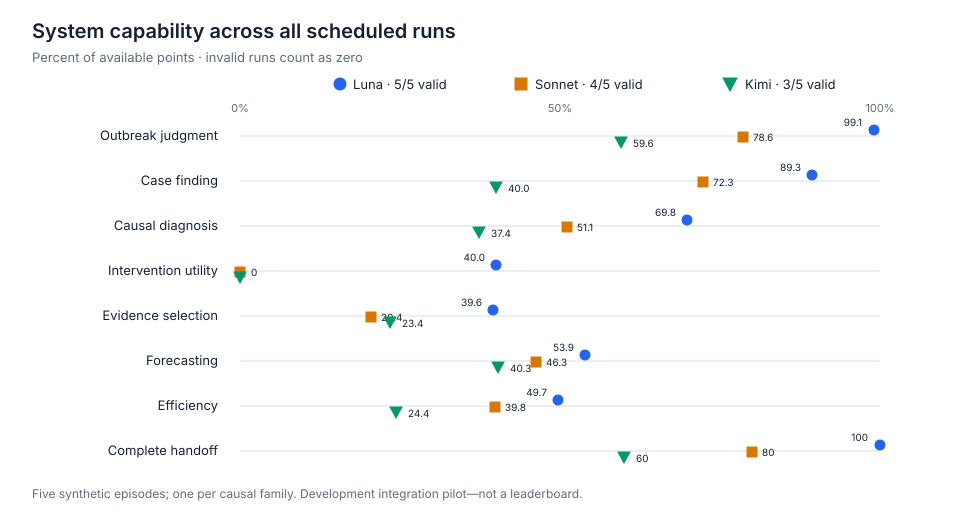

# EpiAgentBench

[](https://github.com/matthew-zhao/epiagentbench/actions/workflows/ci.yml)

EpiAgentBench is a benchmark concept and runnable reference implementation for
testing AI agents on **alert verification and initial outbreak investigation**.

An episode begins with a noisy surveillance alert. The agent must use a limited
budget and simulated time to determine whether the alert represents a true
outbreak, build a defensible line list, investigate competing explanations, and
recommend a proportionate action supported by evidence.

This stage was selected because it combines:

- high public-health impact;
- genuine multi-step investigation and tool use;
- deterministic synthetic ground truth; and
- meaningful opportunities to test reward hacking, privacy, and unsafe action.

The initial scenario pack focuses on foodborne and gastrointestinal events. The
same interface can later support respiratory, healthcare-associated, zoonotic,
and unknown-disease events.

## Implementation status

The repository now contains a working **reference process boundary**. A fresh
evaluator process owns the private seed, scenario family, oracle, unreleased
observations and schedule, action ledger, and scorer. An evaluated agent receives
only a small client that exchanges JSON messages over a connected Unix-domain
socket.

Secure launches also generate a fresh evaluator-private presentation key. Opaque
episode, person, site, report, and observation identifiers are HMAC-derived from
that key rather than from the latent simulator seed, so replaying the same
hidden seed does not reproduce public identifiers. In live Starsim episodes the
same secret also keys independent growth, simulator, and observation streams,
so enumerable development seed numbers cannot be matched to a public trajectory.
The transparent legacy demo uses a deterministic development key only for
reproducibility. A trusted harness may supply and privately retain an
`episode_secret` for exact evaluator replay; it must never place that secret in
the agent container or public trace.

Two capabilities are deliberately separate:

- `SecureEpisodeSession` is evaluator/admin-only. It owns the spawned process
  and the private channel used to score or shut down an episode. Never pass it
  to an agent.
- `epiagentbench_client.InvestigationClient` is the public agent capability. It
  can call the allow-listed investigation operations, but it cannot score an
  episode or retrieve simulator, oracle, seed, family, future-record, or scorer
  state.

The broker accepts JSON only, validates exact request shapes, serializes public
results through explicit field allow-lists, and returns generic rejection
errors. In the container runner, bounded stdout and stderr are streamed back to
the oracle-owning process for canary scanning before scoring; raw stderr is not
returned in the evaluation result. Python object privacy is not treated as the
security boundary.

The repository also includes a Linux/Docker reference runner. It exposes the
public broker as a permission-restricted Unix socket, mounts only that socket
and the agent entry script, and runs the agent non-root with no network, a
read-only root, dropped capabilities, `no-new-privileges`, an ephemeral scratch
tmpfs, and CPU/memory/PID/time/output limits. Each run starts fresh; no container
or VM snapshot is restored. The two Dockerfiles deliberately
separate the client-only agent image from the evaluator/Starsim image.

This is **not yet a production-hermetic benchmark claim**. The `secure-demo`
runs both processes on the same host and from the same source installation. The
Docker runner is Linux-only and was not exercised on this macOS development
host. Digest-pinned execution plans (the artifact format retains the legacy
`snapshot` name) and authenticated run receipts are now implemented, but the
inference proxy, independently attested runtime state, and
full hostile-container red-team suite are not.

## What is here

- [`docs/BENCHMARK_SPEC.md`](docs/BENCHMARK_SPEC.md): benchmark design,
  scenario families, scoring, sandbox boundary, and threat model.
- [`docs/SCIENTIFIC_VALIDATION.md`](docs/SCIENTIFIC_VALIDATION.md): frozen
  seed-panel results, parameter interpretation, and scientific stop-claims.
- [`docs/CALIBRATION_PROTOCOL.md`](docs/CALIBRATION_PROTOCOL.md): exact CDC
  snapshot, leakage-safe temporal splits, gate-free Starsim fitting, private
  cohort commitments, adversarial audits, and hardening gates.
- [`docs/SCIENTIFIC_V3_PROTOCOL.md`](docs/SCIENTIFIC_V3_PROTOCOL.md): the
  LTC-specific intended use, observation/transmission/action evidence contract,
  uncertainty workflow, and non-authoritative local readiness checklist now
  under development.
- [`docs/OPERATIONAL_DATA_REQUEST.md`](docs/OPERATIONAL_DATA_REQUEST.md): the
  privacy-preserving facility and health-department data needed to validate
  alerts, reporting, investigations, and actions that NORS cannot identify.
- [`docs/HUMAN_EVALUATION_PROTOCOL.md`](docs/HUMAN_EVALUATION_PROTOCOL.md): the
  expert solveability, independent adjudication, and construct-validity study
  scaffold; no participant study has yet been run.
- [`src/epiagentbench/nors_ltc_observation.py`](src/epiagentbench/nors_ltc_observation.py):
  a hash-reporting LTC-only adapter for caller-supplied NORS-shaped data. It
  describes reported outbreaks, not hidden infections, and explicitly refuses
  scientific admissibility until a custodian verifies source provenance.
- [`src/epiagentbench/cms_nh_morphology.py`](src/epiagentbench/cms_nh_morphology.py):
  a trusted/offline, development-only CMS facility-margin adapter for beds,
  census, staffing, and turnover. It emits no facility identities, rejects
  public data relabeled as a holdout, and is not yet admissible for simulation
  conditioning or episode generation; ward/contact structure remains
  unidentifiable from this source.
- [`src/epiagentbench/trusted/starsim_ltc_v3.py`](src/epiagentbench/trusted/starsim_ltc_v3.py):
  a trusted-only role/ward/static-contact-topology Starsim foundation with
  explicit placeholder evidence labels and intervention hooks. The engine is
  now available through the secure `starsim-ltc-v3` backend; temporal trace
  contacts are still aggregated to a static graph rather than applied as
  time-varying transmission doses.
- [`src/epiagentbench/trusted/ltc_closed_loop.py`](src/epiagentbench/trusted/ltc_closed_loop.py):
  the evaluator-only active/no-action adapter that turns LTC engine infections
  and simulator-derived symptoms into the existing surveillance interface,
  exposes pseudonymous roles/wards, and routes the three biological controls
  to their matching engine mechanisms. Staff exclusion and environmental
  cleaning hooks remain intentionally unexposed. Its numeric development
  defaults are public placeholders, not secret calibrated production values.
- [`src/epiagentbench/trusted/institution_traces.py`](src/epiagentbench/trusted/institution_traces.py):
  deterministic private development records for rooms, wards, shifts, meals,
  outside entries, contacts, and trace-derived interviews/inspections. It has
  no causal-mode input and is not yet calibrated to operational facility data.
- [`src/epiagentbench/trusted/intervention_evaluation.py`](src/epiagentbench/trusted/intervention_evaluation.py):
  vector outcomes, paired uncertainty draws, stakeholder-weight sensitivity,
  tail harms, regret, negative controls, and dose-response checks.
- [`src/epiagentbench/trusted/branching_manifest.py`](src/epiagentbench/trusted/branching_manifest.py):
  a legacy development-only caller-attested digest contract. It cannot prove
  simulator execution or shared opening states and must not award benchmark
  credit.
- [`src/epiagentbench/trusted/ltc_branching.py`](src/epiagentbench/trusted/ltc_branching.py):
  the trusted counterfactual path. It freezes private inputs, derives opening
  hashes by replaying Starsim, permits only frozen policies, derives outcomes
  internally, authenticates branch receipts with HMAC, and rejects raw or
  incomplete outcome panels.
- [`schemas/`](schemas): public episode and structured-submission schemas.
- [`src/epiagentbench/`](src/epiagentbench): trusted episode generation,
  controller, evaluator service, deterministic scorer, and development baseline.
- [`src/epiagentbench_client/`](src/epiagentbench_client): the small public
  investigator client intended for the untrusted agent side.
- [`docker/`](docker): separate client-only agent and trusted evaluator image
  definitions.
- [`tests/`](tests): unit tests for scoring, provenance, and safety gates.

The original in-process environment remains available as a transparent
development fixture. It is not safe for an untrusted agent because it contains
all episode observations in Python memory.

The scientific-v3 components above are development foundations, not a fitted
or externally validated episode pack. They are intentionally not the production
default. Small files under [`tests/fixtures/`](tests/fixtures/) test parsers;
their [provenance note](tests/fixtures/README.md) says which values are synthetic
and which are a public three-row CMS projection.

## Run the secure reference demo

```bash
PYTHONPATH=src python3 -m epiagentbench.cli secure-demo --seed 7
PYTHONPATH=src python3 -m epiagentbench.cli secure-demo --seed 7 --backend starsim-ltc-v3 --family institution_person_to_person
```

This launches a separate evaluator process, runs the scripted investigator
through the public JSON broker, and sends the final submission through the
separate admin/scoring capability. Its output intentionally contains no
development truth. The second command selects the role-aware long-term-care
development backend and therefore requires the pinned Starsim dependency.

The legacy, inspectable development path and the test suite are:

```bash
PYTHONPATH=src python3 -m epiagentbench.cli demo --seed 7
PYTHONPATH=src python3 -m unittest discover -s tests -v
```

Core scores are programmatic; an LLM judge is not used for leaderboard results.

## Run the development-only agent pilot

The repository includes a public stdio MCP bridge and a deliberately
non-hermetic pilot for locally authenticated cloud-agent CLIs. It currently
pins these full-system pairings:

- Codex CLI with `gpt-5.6-sol`;
- Claude Code with `claude-fable-5`; and
- Cursor Agent with its native `glm-5.2-high` alias.

Run one system or replay one private episode across all three:

```bash
PYTHONPATH=src python3 examples/run_cli_pilot.py codex --seed 1000
PYTHONPATH=src python3 examples/run_cli_pilot.py all --seed 1001
```

Each invocation creates a fresh workspace containing only the public client,
task prompt, schema, and MCP configuration. The private Starsim process and
scorer remain behind the episode socket. Paired runs reuse an evaluator-private
episode secret but never expose it to the agent. The runner records requested
and provider-reported model names, rejects a detected model fallback, rejects
Cursor attempts to use anything outside the exact public MCP allowlist, and
submits output to the strict benchmark validator after the CLI exits.

Single local invocations remain integration smokes, not publishable
comparisons. The CLIs still run on the development host and need provider
network access; the current Linux container runner has no network and cannot
host them unchanged. In particular, Claude Code may route life-science requests
from Fable to another Claude model; the pilot treats that as a failed Fable
attribution rather than silently scoring it. See
[`docs/SCIENTIFIC_VALIDATION.md`](docs/SCIENTIFIC_VALIDATION.md) for the dated
smoke results and remaining gates.

### Trace-enabled 50-episode, six-profile matched panel

The v2 precommitted comparison is preserved for audit, but its one-shot
[environment preflight failed at the first Cursor profile](results/development-matched-50x6-v2.preflight.json)
after four unscored Claude/Codex checks passed; no production episode was
consumed. The frozen receipt distinguishes a Cursor startup/authentication/
routing failure from an episode result, but deliberately retains too little
provider output to separate a bad credential from an unavailable alias or MCP
startup failure. V2 is therefore
[superseded](results/development-matched-50x6-v2.superseded.json), never reset or
replayed. The replacement
[v3 precommitment](results/development-matched-50x6-v3.manifest.json) was then
[superseded before any provider call](results/development-matched-50x6-v3.superseded.json):
an isolation audit proved its disposable Claude credential namespace would
require repeated interactive gateway authorization. A v4 preflight invocation
then aborted during local contract validation, before the provider loop, because
three frozen Glean authentication dependencies had drifted after precommit: the
helper changed from 0.0.30 to 0.0.31, the gateway-token wrapper changed from a
regular file to a symbolic link, and the managed-settings hash changed. The
[v4 manifest](results/development-matched-50x6-v4.manifest.json) and
[supersession record](results/development-matched-50x6-v4.superseded.json) are
preserved for audit. The authenticated private audit confirms zero preflight
provider calls, zero production assignments, and unchanged `prepared` /
preflight-`required` state.

The [v5 replacement](results/development-matched-50x6-v5.manifest.json) used a
fresh cohort, authentication key, private schedule, and pinned gateway wrapper.
Its one-shot [preflight](results/development-matched-50x6-v5.preflight.json)
recorded one attempt at the first Claude profile and failed credential
attestation after about 179 seconds. V5 did not yet have a durable
provider-invocation submarker, so the receipt cannot prove that a model call
returned; the control flow and elapsed time are consistent with one call and it
is conservatively treated as chargeable. No profile passed, no score was
reported, and no production assignment started. V5 is preserved and
[superseded](results/development-matched-50x6-v5.superseded.json), not reset or
retried.

The [v6 replacement](results/development-matched-50x6-v6.manifest.json) used
another fresh cohort, authentication key, private schedule, managed-Glean
credential namespace, and independent Codex credential namespace. Its one-shot
[preflight](results/development-matched-50x6-v6.preflight.json) failed during
the no-model Codex authentication bootstrap, before any model profile or
production assignment. Codex 0.144.3 clears `$CODEX_HOME/auth.json` before
browser OAuth. That removed v6's precreated evaluator symlink, so even a
successful login could write only inside its disposable home; the committed
external credential target remained empty. The retained receipt cannot
distinguish an upstream OAuth error from post-login attestation, because both
streams and the disposable login log were intentionally destroyed.
The bootstrap therefore could not establish the required external credential
postcondition. V6 is preserved and
[superseded](results/development-matched-50x6-v6.superseded.json), not reset or
retried. Its authenticated state and public receipt record zero model-bearing
calls, zero chargeable calls, and zero production assignments. The receipt says
the Glean bootstrap was `started` because both labels were eagerly initialized;
control flow proves Glean was never invoked, and v7 records each bootstrap state
only when that helper is actually launched.

The v7 replacement uses another fresh set of those private artifacts. Its
comparison contains 50 newly frozen `starsim-ltc-v3` episodes—10 from each
causal family—and the same six full agent+model profiles on every episode:

- Codex + GPT-5.6 Sol (medium)
- Codex + GPT-5.6 Luna (medium)
- Claude + Opus 4.8 (high)
- Claude + Sonnet 5 (high)
- Cursor + Grok 4.5 High
- Cursor + Kimi K2.7 Code

V7's one-shot [preflight](results/development-matched-50x6-v7.preflight.json)
passed both no-model authentication bootstraps and the Opus, Sonnet, and Codex
Sol handshakes. Codex Luna then reached the frozen 900-second provider timeout
and failed the provider contract. The two Cursor profiles were never invoked.
The receipt conservatively counts four potentially chargeable provider calls,
reports no scores, and records zero production episodes; no assignment in the
300-run panel started. V7 is retained and
[superseded](results/development-matched-50x6-v7.superseded.json) as a failed,
non-retryable historical preflight rather than reset or resumed.

The [v8 public precommitment](results/development-matched-50x6-v8.manifest.json)
uses a fresh cohort, authentication key, private schedule, managed-Glean
credential namespace, and Codex credential namespace. Its six profiles
preserve the v7 order while making the requested Codex reasoning settings
explicit:

- Claude + Opus 4.8 (high)
- Claude + Sonnet 5 (high)
- Codex + GPT-5.6 Sol (medium)
- Codex + GPT-5.6 Luna (max)
- Cursor + Grok 4.5 High
- Cursor + Kimi K2.7 Code

V8 freezes one uniform 1,800-second limit for every preflight and production
call. It records only bounded, content-free progress buckets and an
evaluator-owned terminal tool-activity count; provider text and identifiers are
never telemetry. A cleanly contained ordinary profile failure is retained and
the unscored preflight continues to later independent profiles. A Codex timeout
quarantines that panel's Codex credential namespace and skips any later Codex
profile, but later independent Cursor or Claude checks may continue. Secret
leakage, credential drift, evaluator drift, or failure to prove process and
pipe cleanup still aborts globally. Production remains locked unless all six
profiles pass.

V8's six-call [preflight](results/development-matched-50x6-v8.preflight.json)
did pass, and its committed receipt unlocked production. Production then
exposed exactly three assignments: Claude Sonnet High and Cursor Kimi K2.7 Code
returned, while Codex Luna Max was durably started before the interactive task's
foreground evaluator process disappeared. The trace-free public
[stopped watermark](results/development-matched-50x6-v8.json) records two
completed assignments and one transport void, but releases no result, score, or
trace. V8 is preserved and
[superseded](results/development-matched-50x6-v8.superseded.json) with terminal
execution and conservative Codex-authentication incidents; it cannot be reset,
retried, or mixed into a replacement estimand.

The replacement execution design is specified in the
[persistent runner protocol](docs/PERSISTENT_RUNNER_PROTOCOL.md). V26 is
superseded; V27 was designed to run as a
finite user LaunchAgent under `caffeinate`, independent of a Codex task,
terminal, PTY, or desktop-app turn. Its owner-only config, worker status,
supervisor lease, and bounded hash-chain log are authenticated; the Cursor key
is read from macOS Keychain only inside the worker and is never placed in the
plist or command line. A scheduled chat heartbeat may observe authenticated
liveness, but it cannot own, restart, or boot out the job. Offline gates now
include a 300-command at-most-once soak and a real fake-only launchd test in
which the initiating process exits while the authenticated production
supervisor core and its fake child continue and complete. The evaluator now
stages only a trace-free pending watermark; a successful preflight receipt or
complete result is published only after the exact create-once supervisor has
an authenticated completed status, matching lease, and terminal event-chain
record. A local-only `finalize` recovery can reconcile a crash after that
completion proof, but cannot restart a worker, authentication flow, or provider.
Those implementation tests themselves authorize no provider call.

V28 retained that detached execution boundary under fresh panel, cohort, and
private namespaces, then failed closed during provider-free preparation-runtime
attestation before any profile or model call. It is terminal and non-resumable.
V29 preserved the detached boundary while splitting preparation-runtime
attestation into five content-free substages and adding a provider-free
phase in the same supervised LaunchAgent child before the irreversible
preflight claim. Its six-call preflight passed, then production failed closed
after the 26th chargeable invocation boundary. V29 is terminal and
non-resumable. Its exact trace-free [production terminal receipt](results/development-matched-50x6-v29.json)
passed pinned provider-free attestation with status
`stopped_supervisor_incident`, 26 terminal assignments, and no scientific
results or scores; its [supersession record](results/development-matched-50x6-v29.superseded.json)
closes the namespace. Those public artifacts and the
[V29 runbook](docs/V29_RUNBOOK.md) are immutable historical evidence. V30
carries the detached boundary forward with
stable Darwin process identity and fresh namespaces. Its source-only design is
in the [V30 runbook](docs/V30_RUNBOOK.md); it authorizes no runtime generation,
authentication, supervisor start, provider call, or spend.

The separately authorized live V9
[preflight](results/development-matched-50x6-v9.preflight.json) passed all six
profiles. Production then stopped fail-closed after seven terminal assignments:
six completed and one Codex Luna Max assignment became an ordinary transport
void. At the clean boundary before assignment eight (Codex Sol), the evaluator
could not re-attest the exact live supervisor and recorded a terminal
`ProviderExecutionIsolationError`; no eighth provider call was launched and no
Codex-authentication incident was recorded. The authenticated outer supervisor
then sealed a `runner_nonzero_exit` incident. Its trace-free
[stopped watermark](results/development-matched-50x6-v9.json) contains only
aggregate counts and releases no result, score, trace, schedule, family, or
episode identity. V9 is non-resumable and contributes no benchmark estimate.
The normalized failure boundary intentionally preserves no arbitrary exception
text, so this evidence identifies the failed live-attestation gate but does not
support a more specific post-hoc predicate diagnosis.

The next-run supervisor contract now closes that diagnostic gap without
weakening the at-most-once boundary. Live attestation emits only a finite safe
failure code. The sole retryable code, `status_snapshot_unstable`, covers an
atomic worker-status replacement or an authenticated torn read of the core
status/lease pair. Initial binding and the read-only checks before and after a
provider call and at final completion may each be retried twice (after 50 ms
and 100 ms) inside a 250 ms deadline, provided the durable attempt or assignment
count is unchanged. The lease copies the exact heartbeat timestamp already
written to status, so an integer-second rollover cannot create a persistently
mismatched authenticated pair. The provider call itself is never inside this
retry loop. No semantic, heartbeat, process-identity, binding, authentication,
or integrity failure is retried. The exact Python launch entrypoint is also
bound by target content plus private symlink/inode topology, preserving normal
virtual-environment launch semantics while detecting byte, inode, or symlink
drift before credential access and child launch. V18 extends that binding to
the pre-private scientific-runtime receipt. The exact V5 Python runs with
`-I -S -B`; the isolated CLIs manually append only the attested repository
source and V5 virtual-environment packages after the standard library, without
executing `site`, `.pth`, or customization hooks. The worker requires the same
full Python/bootstrap binding, closed owner-only runtime-cache v3 inventory,
exact six cache environment variables, installed scientific-distribution
bytes, and fixed real Starsim smoke result committed before the cohort existed.
For the complete Python and cache bindings, public receipts expose only opaque
hashes (alongside the Python target content hash and entrypoint kind). The raw
Python symlink and standard-library bootstrap/module-origin binding is
transient during preflight and is later recomputed and sealed in the
authenticated owner-only LaunchAgent config. The selected Python launch path
also necessarily appears in the local owner-only plist/command; the rest of
the binding does not. The full cache paths, environment, inventory, and
device/inode/UID metadata remain in authenticated private panel state and
later in that config. Path-free scientific module-origin identities remain
public as distribution-relative file names plus content hashes. Finally,
`launchctl`'s literal `state = not running` is parsed as loaded-but-inactive
for authenticated terminal cleanup; that parser was not on V9's
live-attestation path and did not cause the V9 stop. These changes invalidate
the frozen V9 and V14 source contracts.

Stopped production watermarks now add only a finite, trace-free failure stage
and, when applicable, the allowlisted live-attestation code. They reveal no
prompt, provider output, trace, seed, schedule, family, episode identity, or
score. Persistent-supervisor contract schema v7 is a deliberate precommitment
boundary: schema-v6/V17 manifests are incompatible, so this hardening requires
a freshly versioned, prepared, and authorized run.

V10 prepared a fresh cohort and public precommitment, but its sole
authenticated private control state lived in an ignored directory of an
OS-temporary checkout. Cleanup removed that state before the supplied exact
acknowledgment could be bound into the required manifest-specific private
authorization receipt.
The public
[V10 supersession](results/development-matched-50x6-v10.superseded.json) binds
the committed manifest and records that no authentication bootstrap, preflight
profile, model-bearing benchmark call, or production assignment started.
Credential-free preparation identity probes are explicitly excluded from that
zero-call scope. V10 cannot be reconstructed or resumed.

V11 moves the single authoritative private state outside both the repository
and OS temporary storage. Its pre-existing owner-only directory, canonical
path, and parent filesystem identity are HMAC-bound in private state and
revalidated on every authenticated read and atomic write. The public manifest
contains only the path-free storage policy. The live CLI also rejects a
temporary checkout before preparation, authorization, preflight, or
production. V11 requires a fresh cohort, manifest, preflight, and spend
authorization.

V11 then failed before preflight because its background LaunchAgent invoked
Codex device authentication with no interactive terminal and discarded both
output streams. The operator could not see or complete the device-code flow, so
the helper timed out. The public
[V11 supersession](results/development-matched-50x6-v11.superseded.json)
records one zero-model Codex authentication helper, zero model-bearing calls,
zero preflight profiles, and zero production assignments.

V12 was then prepared without authentication or model calls, but a pre-release
audit found that preparation still launched four provider/helper `--version`
commands and copied their provider-controlled output into the unpublished
manifest. Its first private and public writes also used atomic replacement
rather than create-once publication, so competing preparations could produce
an ambiguous pair. The unsafe manifest was withheld. The public
[V12 supersession](results/development-matched-50x6-v12.superseded.json)
records the authenticated zero-model state, the four zero-model identity
processes, and the exact abandoned precommitment without publishing their
output. V12 cannot be authorized, resumed, or reused.

V13 then published a fresh create-once precommitment and received the exact
operator acknowledgement, but the post-acknowledgement authorization check
failed before the private spend receipt write. Between preparation and that
check, the root-managed
`glean-helper` binary and its gateway-token wrapper had been updated; their
prepare-time hashes no longer matched. No helper process, authentication
bootstrap, model-bearing preflight call, or production assignment started. The
public [V13 supersession](results/development-matched-50x6-v13.superseded.json)
binds the published manifest and records that the cohort cannot be resumed or
reused.

V14 moved both sign-ins into a separate
foreground ceremony before the create-once preflight supervisor existed. Codex
runs the pinned
`login --device-auth` flow with its instructions visible in the operator's
terminal; managed Glean likewise keeps its interactive instructions visible
while token-bearing standard output remains suppressed. Successful credentials
are promoted without clobbering into fresh, panel-specific storage. A sanitized
public receipt records that both sign-ins passed, that zero model calls were
made, the precommitted contract and spend-receipt hashes, and one opaque hash
committing the exact authentication-helper bundle. It withholds component
binary hashes, raw paths, credentials, and provider output. That receipt must
be committed before a supervisor can be created.
Preflight and production never attempt login themselves, and the one-shot start
rechecks both credential identities plus Cursor Keychain availability before
writing its irreversible start marker.

V14 completed that foreground authentication ceremony, then stopped
fail-closed during its
[preflight](results/development-matched-50x6-v14.preflight.json) after three
conservatively chargeable calls. Both Claude profiles passed; Codex Sol
returned, then the post-harness live supervisor check reported
`status_snapshot_unstable`. The
[V14 supersession](results/development-matched-50x6-v14.superseded.json) binds
the manifest, authentication receipt, and stopped preflight artifact. The
create-once V14 run is non-resumable, its cohort cannot be reused, and no
production assignment started.

V15 then froze a fresh 50-episode cohort, but its selected bare `python3`
could not import Starsim during manifest preparation. The failure occurred
before the create-once cohort claim, private panel state, public manifest,
authorization, authentication, or any provider/helper process. The
[V15 supersession](results/development-matched-50x6-v15.superseded.json) binds
the exact published source and records that the V15 cohort, key, and empty
credential namespaces are non-resumable and forbidden for reuse.

V16 passed its foreground authentication ceremony, then stopped during the
first Claude profile in its trace-free
[preflight](results/development-matched-50x6-v16.preflight.json). Its
[supersession receipt](results/development-matched-50x6-v16.superseded.json)
records one started-but-not-finished, conservatively chargeable Claude call,
zero production assignments, and no released result, score, or trace. The
failure was in the control-plane terminal handoff rather than evidence of a
provider-specific fault. V16 is terminal and non-resumable; its cohort, key,
credential namespaces, and runtime cannot be reused.

V17 completed provider-free preparation and foreground authentication. Its
sole preflight `start` command was then refused before the durable start marker
because the operator invocation omitted the six frozen runtime-cache
environment variables. The
[V17 supersession receipt](results/development-matched-50x6-v17.superseded.json)
binds the published runtime, manifest, and authentication receipts and records
one control invocation but no worker, provider process, preflight profile, or
model call. No preflight or results artifact exists. V17 is terminal and none
of its cohort, key, credential, cache, supervisor, or Keychain namespaces may
be reused.

V18 completed provider-free preparation and foreground authentication, then
stopped during its first Claude preflight profile. Its released trace-free
[preflight receipt](results/development-matched-50x6-v18.preflight.json)
retains the legacy `provider_execution` /
`provider_adapter_execution_failed` projection and one
`started_not_finished` provider invocation. An offline control-path audit
strongly indicates that the non-model Claude CLI readiness probe timed out
before the model-bearing process was spawned. Because V18 persisted its marker
before that probe, the evidence cannot prove zero billing: the
[V18 supersession](results/development-matched-50x6-v18.superseded.json)
therefore retains one conservatively chargeable call and adds $5 to the prior
Claude ceiling without retroactively rewriting the historical receipt. No
production assignment, score, or trace was released. V18 is terminal and none
of its private or execution namespaces may be reused.

V19 completed its provider-free runtime receipt, private freeze, manifest,
and exact spend authorization, then failed at foreground authentication entry
because the command relied on six caller-supplied runtime-cache variables.
That failure occurred before the operator TTY or an authentication helper. A
corrected Codex device ceremony was cancelled after the at-most-once audit;
this was not caused by the user withholding device approval. The
[V19 supersession](results/development-matched-50x6-v19.superseded.json)
records zero model-bearing calls, no credentials, no public authentication
receipt, and no preflight or production start. V19 is terminal and none of its
private or execution namespaces may be reused.

V20 versioned the panel identifier, top-level schema, corrected $590
cumulative acknowledgement, fresh path namespace, supervisor contract
`epiagentbench.persistent_supervisor_contract.v9`, launchd config
`epiagentbench.launchd_agent.v12`, execution-context protocol
`persistent-supervisor-v6`, authentication setup
`epiagentbench.authentication_setup.v3`, and
[execution runbook](docs/V20_RUNBOOK.md). V20 uses a two-commit
provider-free preparation boundary: first publish the code commit; at that
exact commit generate the scientific-runtime receipt twice under `-I -S -B`
and compare it byte-for-byte; then publish the unchanged receipt through an
atomic create-once link as the second commit. Only a fresh checkout at that
receipt commit may create the fresh key, empty credential directories,
canonical freeze claim, cohort, private state, and public manifest. The
manifest is transferred through the same no-clobber boundary, then published
separately. The phase stops before authorization, so no V20 authentication,
provider, or model call occurs.

V20 removes the remaining foreground shell-environment dependency.
Preparation and every scientific-runtime-loading operator command take one
explicit bound runtime-cache directory and install the exact six variables
internally before scientific imports. Config-backed controls and the launchd
worker derive the same values from their HMAC-authenticated config. Every
boundary overwrites absent or poisoned ambient values and restores their prior
presence and bytes in a `finally` boundary. Each action retains one
authenticated config/key snapshot; finalization exact-compares a fresh
authenticated read before mutation, so a replacement config cannot be
evaluated under the first config's environment. The variables remain absent
from plist and argv. After the TTY gate, foreground authentication durably
claims the ceremony before any live execution, dependency, repository,
credential, or provider check; a post-claim integrity failure is terminal with
a finite public code and a second ceremony is rejected. This self-bootstrap
and claim boundary are combined with V16's finite incident taxonomy, durable
terminal receipts, reserved handled exit 64, provider-free prelaunch
attestation, and provider-free reconciliation.

The V20 authentication claim also seals a closed helper-attempt history.
Passing requires durable launch-pending, started, returned, and integer
zero-return markers. A launch-pending record without a started or start-failed
record is terminal ambiguity and cannot be retried. Terminal state recomputes
known helper starts and ambiguous starts from that history, and code,
dependency, or credential drift after a helper returns keeps a distinct
finite post-return cause.

V20 then stopped on the first Claude preflight profile before the durable
model-invocation boundary. The authenticated, sanitized
[V20 preflight receipt](results/development-matched-50x6-v20.preflight.json)
records `model_invocation_state = "not_started"`, zero conservatively
chargeable calls, zero production episodes, and no scores. Its V20 taxonomy
collapsed the exact pre-model subphase to the generic
`provider_execution` / `provider_adapter_execution_failed` projection, so the
public evidence cannot honestly distinguish CLI-identity readiness from
trusted episode startup. The
[V20 supersession](results/development-matched-50x6-v20.superseded.json)
therefore preserves that uncertainty rather than inventing a more specific
cause. V20 is terminal and none of its cohort, key, credential, cache,
supervisor, or execution namespaces may be reused.

V21 added that ordered, content-free pre-model phase contract and its
authenticated [preflight receipt](results/development-matched-50x6-v21.preflight.json)
localized the first-profile failure to `episode_startup`, before model
invocation, with zero conservatively chargeable calls and zero production
episodes. The exact internal cause was then reproduced provider-free: Python
`multiprocessing` replayed the real isolated runner file as `__mp_main__`,
inherited the parent’s already-extended `sys.path`, and the runner appended
the repository and virtual-environment paths a second time. The unchanged
strict validator correctly rejected those duplicates before the broker could
report ready. V21 is terminal; its exact public bindings and non-reuse rule
are recorded in the
[V21 supersession](results/development-matched-50x6-v21.superseded.json).

V22 makes that bootstrap exact and idempotent for only two legitimate states:
the pristine isolated parent and its exact inherited `spawn` replay. Partial,
duplicated, reordered, displaced, or trailing bindings still fail closed.
Trusted episode startup now reports only a finite content-free substage, never
exception text or benchmark data. The durable model-invocation marker remains
the only chargeability boundary.
The versioned identifiers, fresh namespaces, publication gates, and
provider-free stopping point are defined in the
[V22 runbook](docs/V22_RUNBOOK.md). This control-plane work does not create a
V22 runtime receipt, manifest, private state, credential namespace,
supervisor, authentication ceremony, or model call.

The runtime receipt proves exact Starsim 3.5.1 and executes a hardcoded
three-person, four-day LTC scenario twice per branch through the real
Starsim-backed engine. In the no-action branch, a seeded resident
deterministically transmits to staff across the sole direct-care edge; a
matched day-one contact-stop counterfactual prevents that transmission. This
is a deterministic capability smoke, not calibration evidence, a biological
effect estimate, or a benchmark score. The receipt binds that aggregate
result, actual installed bytes of the declared scientific distributions, and
the clean source and CLI contracts. V22 additionally starts the real
controller/socket broker for all five public causal families at public seeds
`0`, `7`, and `2**31 - 2`, twice serially: 30 trusted-evaluator starts through
the actual `-I -S -B` file entrypoint. The receipt retains only fixed public
inputs, counts, reproducibility status, and aggregate transcript hashes—never
raw observations, generated identifiers, paths, secrets, hidden state,
traces, or scores. It also commits opaque hashes for the full
Python entrypoint/bootstrap binding and for a closed, bounded, current-user
runtime-cache v3 tree. That tree has an exact current-user `0700` root whose
only entries are exact current-user `0700` directories named `matplotlib`,
`numba`, and `xdg`; below those children it permits at most 10,000 total
descendants (directories plus regular files), all owner-only, nonsymlinked,
and on the root filesystem. Regular files are single-link, at most 512 MiB
each, with at most 4 GiB of regular-file content in total. Receipt bytes and
command summaries must be staged outside that cache root. The public receipt
includes the Python target content hash and entrypoint kind, path-free
scientific module-origin identities, and only opaque hashes for the complete
Python and cache bindings; it includes no raw absolute Python/cache path,
environment, inventory, or device/inode/UID topology. It explicitly records
zero provider processes, authentication processes, and model calls, and
contains no private benchmark data. The same interpreter and cache bindings
are mandatory for cohort
freeze, prepare, preflight, and production. This versioning step itself does
not prepare V22, authorize spend, authenticate a provider, create a supervisor,
or make a model call.

V22 subsequently published its provider-free runtime receipt and frozen
manifest, recorded the exact spend acknowledgement, and began foreground
authentication. The Codex device-auth coordinator then disappeared after
durable `running` state but before provider return, credential promotion, or
public receipt publication. No model call, preflight profile, production
assignment, score, or trace was produced. The pinned V22 code terminalized the
ambiguous ceremony as `interrupted_authentication_ceremony`; its single
owner-only staging directory was removed without reading credential contents.
V22 is terminal and non-resumable, as recorded in the
[V22 supersession](results/development-matched-50x6-v22.superseded.json).

V23 then completed its provider-free preparation and authentication and ran
all six disposable preflight profiles. The evaluator child passed all six, but
the intentionally dependency-free outer release worker tried to re-import
Starsim and re-inventory scientific distributions under its deliberate
`-I -S` no-site boundary. Release failed closed before an official passing
receipt was published. V23 made six model calls (two per provider family),
started no production assignment, released no score or trace, and is terminal;
see the [V23 supersession](results/development-matched-50x6-v23.superseded.json)
and preserved [V23 runbook](docs/V23_RUNBOOK.md).

V24 preserves V23's scientific and live provider-boundary checks while fixing
only post-completion publication. The no-site worker now validates the sealed
runtime commitments, freshly re-hashes the provider-free tracked source
contract, and validates the authenticated preparation binding, cohort
manifest, and private packs without importing scientific packages. It permits
safe owner-only cache-content evolution inside the sealed cache topology and
emits only a finite authenticated release-failure code—never exception text.
The full release transition is serialized: premature or lock-contention
requests are read-only, and a post-`release_pending` failure is classified
before the owner control lock is released. The cross-module regression
exercises the real LaunchAgent-to-panel finalizer with Starsim unavailable.
Fresh identifiers, namespaces, publication gates, and operator steps are
defined in the [V24 runbook](docs/V24_RUNBOOK.md). This V24 control-plane
change creates no runtime receipt, manifest, private state, credential
namespace, authentication ceremony, supervisor, or model call.

V24 was then superseded at the operator's direction before provider-free
preparation. It created no runtime receipt, manifest, key, cohort, private
state, credential namespace, authentication ceremony, supervisor, provider
process, or model call. Those zero-call facts and the exact pinned V24 source
milestone are preserved in the
[V24 supersession record](results/development-matched-50x6-v24.superseded.json).
V25 then made one provider-free preparation-runtime attempt under `env -i`.
Its credential-stripped PATH also omitted Cursor's installed CLI directory, so
static CLI discovery failed before the scientific runtime, Starsim smokes,
private preparation, provider processes, or model calls. V25 is terminal; its
zero-call facts are preserved in the
[V25 supersession record](results/development-matched-50x6-v25.superseded.json).

V26 replaced ambient executable discovery with a source-owned allowlist. The
preparation process PATH contains only system tools, while provider resolution
separately searches fixed system/Homebrew roles and the current account's
`.local/bin` role without consulting environment `PATH` or `HOME`. The exact
credential-free process environment uses fresh empty owner-only HOME and
TMPDIR directories and rejects every extra variable before benchmark imports.
Its path-free public contract and selected CLI byte hashes are part of the
runtime identity. The LaunchAgent also seals a fixed system-only child PATH.
V26's preflight later terminated before it could publish a valid public
preflight receipt. Because the older wrapper could not prove an exact provider
call count after that control-path failure, V26 is preserved as terminal and
[superseded](results/development-matched-50x6-v26.superseded.json) with a
conservative two-Claude-call ($10) allowance.

V27 carries the same scientific design forward under fresh identifiers and
namespaces, but closes that control-plane gap. It claims a one-shot,
authenticated incident envelope before volatile preflight gates; records a
finite durable phase and conservative call count from durable invocation
markers; persists a minimal terminal candidate before repository binding or
public writes; and adds a provider-free outer audit. Exit 64 still means the
private and public terminal receipt match exactly. Exit 65 means only the
private incident is sealed; after provider credentials are removed, the outer
worker must reconcile, audit, and independently re-attest the exact public
receipt before normalizing the outcome to exit 64. The full sequence is in the
[V27 runbook](docs/V27_RUNBOOK.md).

V27 later failed closed during that provider-free control path. Its immutable
[preflight receipt](results/development-matched-50x6-v27.preflight.json) and
[supersession record](results/development-matched-50x6-v27.superseded.json)
record terminal failure at `contract_attestation`, zero completed profiles,
zero conservatively chargeable model invocations, zero production episodes,
and no scores. The offline audit re-attested the surviving runtime, source,
CLI, profile, replay, supervisor, Starsim-smoke, and broker-startup contracts,
but the v1 incident envelope cannot distinguish an inner private contract
failure from failure to persist the immediately following checkpoint. V27 is
terminal, non-resumable, and forbidden for cohort or namespace reuse. Its
[runbook](docs/V27_RUNBOOK.md) is immutable historical evidence only.

V28 was designed to close that specific ambiguity under fresh identifiers
`development-matched-50x6-v28` and `development_matched_panel_v28`. Before
each provider-free contract group it durably recorded a finite
`attempted_operation` and last `completed_operation`; validation failures also
carried a finite `contract_failure_code`. Checkpoint-persistence failures kept
separate codes, so they cannot be misreported as failed validation. The same
content-free fields were exact-compared through incident envelope v2, terminal-
incident attestation v2, and provider-free terminal audit v2. They exposed no
exception text, private path, provider output, prompt, observation, hidden
episode identity or family, credential, schedule, score, or trace. The full
historical sequence is preserved in the terminal
[V28 runbook](docs/V28_RUNBOOK.md). The no-site outer
worker independently rejects invented finite-looking names, control fields on
provider incidents, and failure codes that do not match the attempted check.

V28 later failed at the still-coarse `preparation_runtime` operation after
`authentication_binding` completed. Its authenticated terminal projection
records zero completed profiles, zero conservatively chargeable model
invocations, zero production episodes, and no scores. Public receipt and
commit-order checks passed during the offline audit, and the surviving cache
still matched its opaque public commitment; the record cannot safely
distinguish the cache identity, either live smoke, or private cache binding.
V28 and every V28 namespace are terminal and forbidden for retry or reuse. Its
[runbook](docs/V28_RUNBOOK.md) is immutable historical evidence only.

V29 supersedes V28 under fresh identifiers `development-matched-50x6-v29` and
`development_matched_panel_v29`. The five ordered operations are
`preparation_runtime_bound_contract`,
`preparation_runtime_starsim_smoke`,
`preparation_runtime_episode_startup_smoke`,
`preparation_runtime_cache_identity`, and
`preparation_runtime_private_cache_binding`, each with its matching finite
`_failed` code. Cache identity performs one complete inventory per boundary
after both smokes, so their final cache state is what crosses the claim.
Before the irreversible six-call preflight claim, the same supervised child
runs a provider-free phase containing all five operations—including the
complete 30-start broker smoke—in
the exact later LaunchAgent panel-child environment. It cannot read a provider
credential, claim preflight, consume an episode, invoke a provider, or project
a score. Before its first trace mutation it exact-checks the sealed spend
receipt, canonical committed authentication-receipt bytes and repository
binding, and authenticated supervisor execution binding. The first trace seals
that prerequisite bundle. After a separately durable passed trace, the same
child exact-re-attests the bundle and performs one exactly-once claim with
full-state reconciliation and no repair of ambiguous state. Production and
success finalization independently require that exact passed trace. See the
[V29 runbook](docs/V29_RUNBOOK.md).

V29 also makes the broker's filesystem assumptions executable: provider-free
`TMPDIR` is capped at 72 UTF-8 bytes so the fixed 28-byte episode/socket suffix
fits the 100-byte Unix-socket limit. The LaunchAgent seals that `TMPDIR` as a
canonical, current-owner, exact-`0700` directory before it writes the runtime
configuration. Clean `HOME` and `TMPDIR` are held by
non-inheritable directory descriptors and re-attested between scientific
substages; only finite `EINTR` is retried. The offline evaluator seams are
confined to one owner-only ephemeral namespace and reject Git worktrees,
external result/state paths, and external credential directories.

The unused [v1 precommitment](results/development-matched-50x6-v1.manifest.json)
is preserved for audit history but was [abandoned before any provider preflight
or production assignment](results/development-matched-50x6-v1.superseded.json)
when terminal replay traces changed the frozen evaluator and generator
fingerprint. V2 therefore had new seeds, secrets, authentication key, schedule
nonce, and packs—not a modified or replayed version of v1. The still earlier
[50×4 precommitment](results/development-matched-50x4-v1.manifest.json) was
likewise [discarded before preflight](results/development-matched-50x4-v1.superseded.json)
after its private pack surface entered an internal audit context.

Each future V29 assignment is designed to record an evaluator-owned,
aggregate-only trace:
six-hour active-policy and matched no-action infection frames, reporting-artifact
counts, finite-enum agent steps, and requested/effective control changes. The
trace excludes people, contact edges, target and evidence identifiers, model
text, causal labels, seeds, and simulator parameters. Rejected calls are reduced
to finite sentinels. Traces remain private through all progress checkpoints and
can be released only after all 300 assignments are terminal and an authenticated
cohort-retirement marker is durable. The panel rejects traces that disagree with
the score endpoint, contradict their control events, or give the six profiles
different no-action futures for the same episode.

The runner predeclares a hidden six-condition Williams schedule with 300
assignments. Every profile occupies each execution position 8 or 9 times
overall and 1 or 2 times within every family. Preparation itself is
provider-process-free. The tracked runtime receipt is published before the
key, cohort, schedule nonce, or private state exists. The matched freezer and
prepare command each re-attest that receipt before accessing those private
surfaces. The freezer first burns one HMAC-authenticated, create-once claim at
the canonical hidden path in the authentication-key namespace and appends a
separate completion only after the cohort is durable. Both `freeze` and
`prepare` require that exact claim path; a pending claim without completion is
terminal and nonretryable. Provider executable content hashes, path-free
source-owned discovery roles, and static routing policy are read directly; no
provider CLI, Glean helper, authentication
helper, or model process is launched, and no provider-controlled version string
enters a manifest or public result.
Because the root-managed Glean helper and token wrapper can be updated while an
operator reviews the manifest, their fixed paths, ownership, and dispatch
semantics are frozen at preparation, while their exact bytes are frozen
by repeated consistent sampling and bound in the same authenticated private
write as the manifest-bound spend authorization. The sanitized
authentication receipt commits those byte identities before preflight, and
every authentication, preflight, and production boundary re-attests them. They
are never silently refreshed. A host-global preparation lease, an
authenticated create-once cohort claim, and private-first/public-second
no-clobber publication make a partial or competing preparation fail closed.
Model-attributable failures—including invalid reports, receipt mismatches, and
cleanly contained non-Codex timeouts—remain in each profile's fixed 50-episode
denominator as zero. Harness or transport failures are sealed as non-retryable
transport voids instead of being silently dropped. A Codex timeout is the one
timeout exception: killing it during an in-place credential refresh could
leave authentication ambiguous, so the assignment is a terminal transport
void and the panel cannot complete.

Before production, V29 first completes an operator-owned Terminal,
foreground, zero-model authentication ceremony. Only after its sanitized
receipt is committed does V29 start its supervised LaunchAgent child. That
same child exact-checks its spend, published-authentication, and supervisor
prerequisite bundle; completes the provider-free preclaim; durably seals its
passed trace; re-attests those prerequisites; reconciles the one-shot claim;
and only then begins a disposable six-call, unscored
infrastructure/routing handshake on one shared synthetic episode. The handshake
checks the frozen runtime and routing surfaces, exact model identity where
receipts exist, evaluator replay plumbing, and the public tool boundary where
the provider exposes it. It deliberately does not require a valid final report,
a minimum tool count, or a passing score: those are model capabilities measured
in the fixed production denominator. The receipt reports finite durable call
states and a conservative chargeable-call count, but no scores and no production
episode is consumed. Cursor's narrow provider adapter requires an explicit
`CURSOR_API_KEY`; host login state is not copied into assignments. The outer
worker does not read the key. After claim, the child reads it exactly once,
only when the first Cursor evaluator is reached; caches it only in child
memory; adds it to the environment only around Cursor subprocesses; and wipes
both cache and environment in the outer `finally`. Starsim/broker work and
Claude and Codex calls never receive it. The terminal analysis predeclares
20,000-draw family-stratified bootstrap intervals and adjusts all 15 exploratory
pairwise comparisons together.

This remains development evidence—not held-out epidemiological calibration, a
base-model leaderboard, or a real-world superiority claim. Prior medium-effort
runs suggested roughly 19–21 serial hours, but Luna Max has not yet been timed
on this panel. The 1,800-second ceiling makes the mechanical 300-call worst case
150 hours; observed runtime should be reported rather than inferred. V28 was
authorized under a historical `$610` cumulative Claude ceiling but failed
before any model invocation, so it adds zero realized or conservative model
calls. V29 retains a `$510` current-run Claude ceiling and the conservative
`$100` allowance for prior panels, for `$610` cumulative; Codex and Cursor
remain uncapped. Its exact acknowledgement text and hash are now source-owned,
but no manifest-bound spend receipt exists. None of these limits authorizes V29
spend; see the [V29 runbook](docs/V29_RUNBOOK.md).
V8 was the first matched-panel version to start production; its two returned
records and one interrupted call remain private audit evidence and are not
benchmark results.

V20, V21, V22, V23, V24, and V25 acknowledgements and authentication procedures are retained
only in their terminal [V20](docs/V20_RUNBOOK.md),
[V21](docs/V21_RUNBOOK.md), [V22](docs/V22_RUNBOOK.md), and
[V23](docs/V23_RUNBOOK.md) runbooks and the superseded
[V24 runbook](docs/V24_RUNBOOK.md) and
[V25 runbook](docs/V25_RUNBOOK.md); they must not be executed or reused.
V26, V27, and V28 are terminal and must not be resumed or reused. Any future
V29 preparation must follow the fresh namespaces, provider-free preclaim
boundary, and placeholder discipline in the
[V29 runbook](docs/V29_RUNBOOK.md).

V27 retained the `$510` current-run Claude ceiling and used a conservative
`$100` allowance for prior panels. V20, V21, and V22 each add `$0`; V23 adds `$10`
for its two Claude preflight calls; V24 adds `$0` because it remained
control-plane-only; V25 adds `$0` because static provider-free CLI discovery
failed before any provider process; V26 adds a conservative `$10` because its
preflight call count is indeterminate. Its cumulative ceiling was therefore
`$610`. Codex and Cursor remained uncapped. V27 required this exact historical
acknowledgement, which is retained for audit evidence and must not be reused:

> I acknowledge the replacement six-call v27 preflight and 300-assignment production run, including unbounded Codex/Cursor provider spend and up to $610 total Claude spend across the failed v2 preflight, failed v5 preflight, failed v6 authentication bootstrap, failed v7 preflight, failed v8 production run, v9 preflight and failed production run, the abandoned zero-model-call v10 precommitment, the failed zero-model-call v11 authentication bootstrap, the abandoned zero-model-call v12 precommitment, the abandoned zero-model-call v13 precommitment, the failed v14 preflight, the failed zero-model-call v15 pre-claim preparation, the failed v16 preflight, the failed zero-model-call v17 pre-start runtime-cache-environment refusal, the failed v18 preflight, the failed zero-model-call v19 authentication setup, the failed zero-model-call v20 preflight, the failed zero-model-call v21 preflight, the failed zero-model-call v22 interrupted authentication ceremony, the failed v23 six-call preflight release validation, the abandoned zero-model-call v24 control-plane precommitment, the failed zero-model-call v25 provider-free preparation-runtime CLI discovery, the failed v26 preflight with indeterminate provider-call count and a conservative $10 Claude allowance, and the v27 preflight and production run.

Its SHA-256 is
`47c3e8d7eb79a574acffaf6f480b84fe8f44494775af994d4b1d40b3752f59f4`.
V27 is terminal; this text no longer authorizes authentication or execution.

V28 retained the `$510` current-run Claude ceiling and the conservative `$100`
allowance for prior panels. V27 adds `$0` because its authenticated terminal
receipt proves that no model invocation became conservatively chargeable. The
cumulative ceiling remained `$610`; Codex and Cursor remained uncapped. V28
used this exact historical acknowledgement:

> I acknowledge the replacement six-call v28 preflight and 300-assignment production run, including unbounded Codex/Cursor provider spend and up to $610 total Claude spend across the failed v2 preflight, failed v5 preflight, failed v6 authentication bootstrap, failed v7 preflight, failed v8 production run, v9 preflight and failed production run, the abandoned zero-model-call v10 precommitment, the failed zero-model-call v11 authentication bootstrap, the abandoned zero-model-call v12 precommitment, the abandoned zero-model-call v13 precommitment, the failed v14 preflight, the failed zero-model-call v15 pre-claim preparation, the failed v16 preflight, the failed zero-model-call v17 pre-start runtime-cache-environment refusal, the failed v18 preflight, the failed zero-model-call v19 authentication setup, the failed zero-model-call v20 preflight, the failed zero-model-call v21 preflight, the failed zero-model-call v22 interrupted authentication ceremony, the failed v23 six-call preflight release validation, the abandoned zero-model-call v24 control-plane precommitment, the failed zero-model-call v25 provider-free preparation-runtime CLI discovery, the failed v26 preflight with indeterminate provider-call count and a conservative $10 Claude allowance, the failed zero-model-call v27 preflight, and the v28 preflight and production run.

Its SHA-256 is
`dfdeadc9722bdd5112c8189d4512542cb101a805dd625990c9e8af3b46e63e4e`.
V28 is terminal with zero model calls, zero completed profiles, zero production
episodes, and no scores. This text and hash no longer authorize any action.

V29's budget decomposition is fixed at `$510` for the current run plus the
conservative `$100` prior-panel allowance, or `$610` cumulative; Codex and
Cursor remain uncapped. Its source-owned exact acknowledgement is:

> I acknowledge the replacement six-call v29 preflight and 300-assignment production run, including unbounded Codex/Cursor provider spend and up to $610 total Claude spend across the failed v2 preflight, failed v5 preflight, failed v6 authentication bootstrap, failed v7 preflight, failed v8 production run, v9 preflight and failed production run, the abandoned zero-model-call v10 precommitment, the failed zero-model-call v11 authentication bootstrap, the abandoned zero-model-call v12 precommitment, the abandoned zero-model-call v13 precommitment, the failed v14 preflight, the failed zero-model-call v15 pre-claim preparation, the failed v16 preflight, the failed zero-model-call v17 pre-start runtime-cache-environment refusal, the failed v18 preflight, the failed zero-model-call v19 authentication setup, the failed zero-model-call v20 preflight, the failed zero-model-call v21 preflight, the failed zero-model-call v22 interrupted authentication ceremony, the failed v23 six-call preflight release validation, the abandoned zero-model-call v24 control-plane precommitment, the failed zero-model-call v25 provider-free preparation-runtime CLI discovery, the failed v26 preflight with indeterminate provider-call count and a conservative $10 Claude allowance, the failed zero-model-call v27 preflight, the failed zero-model-call v28 preflight, and the v29 preflight and production run.

Its SHA-256 is
`46b3b9477b44a3c6312746bd2632b40a825c30a774f66d1ca3eb4d6f684338cc`.
This text and hash alone authorize nothing: a later explicit operator
acknowledgement must be sealed against the exact published V29 manifest and
public precommitment before authentication or execution.

The V29 control plane uses runtime receipt schema
`epiagentbench.preparation_runtime_preflight.v4`, bound preparation schema
`epiagentbench.bound_preparation_runtime.v3`, persistent-supervisor contract
`epiagentbench.persistent_supervisor_contract.v14`, LaunchAgent config
`epiagentbench.launchd_agent.v15`, provider-free preclaim
`epiagentbench.provider_free_preclaim.v3`, prerequisite bundle
`epiagentbench.provider_free_preclaim_prerequisites.v1`, preflight incident
envelope `epiagentbench.preflight_incident_envelope.v3`, and terminal audit
`epiagentbench.terminal_audit.v3`. The clean preparation environment is
`epiagentbench.provider_free_preparation_environment.v2`. These version
constants authorize no
authentication, supervisor start, provider call, or spend.

V30 supersedes terminal V29 under fresh identifiers
`development-matched-50x6-v30` and `development_matched_panel_v30`. It advances
the persistent-supervisor contract to
`epiagentbench.persistent_supervisor_contract.v15`, the supervisor family to
v4, process identity to v3, protocol to v9, and LaunchAgent family to v16.
V30 accepts only a canonical Darwin boot-session UUID and numeric
`proc_pidinfo` process birth identity; unavailable construction fails before an
evaluator child can start or lease, status, or event state can be written. The
full namespace and create-once gates are frozen in the
[V30 runbook](docs/V30_RUNBOOK.md).

The conservative prior-through-V29 Claude allowance is `$160`: `$100` through
V28, at most `$10` for V29's two Claude preflight calls, and at most `$50` for
ten Claude calls among its first 26 production invocations without inspecting
the private schedule. Adding the unchanged `$510` V30 current-run ceiling gives
a `$670` cumulative ceiling. Codex and Cursor remain uncapped. These ceilings
are source-owned accounting, not authorization. The exact V30 acknowledgement
is:

> I acknowledge the replacement six-call v30 preflight and 300-assignment production run, including unbounded Codex/Cursor provider spend and up to $670 total Claude spend across the failed v2 preflight, failed v5 preflight, failed v6 authentication bootstrap, failed v7 preflight, failed v8 production run, v9 preflight and failed production run, the abandoned zero-model-call v10 precommitment, the failed zero-model-call v11 authentication bootstrap, the abandoned zero-model-call v12 precommitment, the abandoned zero-model-call v13 precommitment, the failed v14 preflight, the failed zero-model-call v15 pre-claim preparation, the failed v16 preflight, the failed zero-model-call v17 pre-start runtime-cache-environment refusal, the failed v18 preflight, the failed zero-model-call v19 authentication setup, the failed zero-model-call v20 preflight, the failed zero-model-call v21 preflight, the failed zero-model-call v22 interrupted authentication ceremony, the failed v23 six-call preflight release validation, the abandoned zero-model-call v24 control-plane precommitment, the failed zero-model-call v25 provider-free preparation-runtime CLI discovery, the failed v26 preflight with indeterminate provider-call count and a conservative $10 Claude allowance, the failed zero-model-call v27 preflight, the failed zero-model-call v28 preflight, the v29 passing preflight and terminal production run with a conservative $60 Claude allowance, and the v30 preflight and production run.

Its SHA-256 is
`197ce6f0938bad1f8aa3c20c5e052a9519312d4814ffa088bbba99f4e31a42e5`.
It must later be explicitly supplied and sealed against the exact published
V30 manifest and public precommitment before it can authorize anything.

The V29 design requires the runner, runtime, hidden cohort, credential
namespaces, and public manifest to be frozen before any model-bearing provider
call. Its Claude contract keeps
conversation, configuration, session, and ordinary home storage disposable,
while an evaluator-created link exposes exactly one panel-specific managed
Glean credential directory to the trusted helper. That directory must be empty
at prepare and may contain only one current-user, owner-only
`credentials.json` afterward. The evaluator checks file metadata only—never
credential contents or a credential hash—and requires the obsolete Claude
Keychain namespace and Claude's own plaintext fallback to remain absent. A
private keyed commitment binds the canonical directory and filesystem identity
without publishing its path.

Codex uses a separate empty-at-prepare, current-user `0700` directory whose only
persistent entry may be one owner-only `auth.json`. Browser OAuth runs in a
same-filesystem disposable staging home with no precreated auth link, because
the pinned Codex 0.144.3 login command deliberately clears that path before
authentication. After a clean login return, the evaluator checks the staged
file's type, owner, mode, link count, size, and stable identity, then promotes
the opaque file without clobbering into the still-empty committed directory and
removes all staging logs and state. It never reads, parses, hashes, copies, or
logs the credential contents. Each later model invocation gets a fresh ordinary
home, configuration, cache, session, and temporary tree; only then does an
evaluator-owned `auth.json` link reach the stable credential file, with
`cli_auth_credentials_store="file"` forced inline. Codex refreshes this file in
place, so refreshes survive across the serial preflight and production calls
without sharing the desktop login. The evaluator checks the directory, file
inode, and link before and after calls. After a durable model-invocation start, a
Codex timeout or credential/link drift makes the panel non-resumable because a
killed in-place refresh could leave authentication ambiguous. A cleanly
returned, non-timeout Codex error is an ordinary transport void and does not by
itself poison the credential namespace.

Non-model CLI readiness commands run before the durable model-invocation
marker. A typed readiness timeout is never retried and contributes zero
conservatively chargeable model invocations when that marker remains absent;
it ends preflight, while production records the finite transport-void reason
`provider_cli_readiness_timeout`, publishes readiness as both its failure and
timeout stage, and continues in the same worker. The evaluator writes
`model_invocation.started` only in the callback
immediately before it spawns the actual model-bearing process; marker
persistence failure prevents the spawn, while any interruption after a durable
start remains conservatively chargeable. Preflight and production use this same
boundary.

Every model-bearing provider command runs in a new POSIX session with bounded
output capture. Before the evaluator moves on, it terminates and verifies the
command's original process group and requires its captured pipes to close. A
crash after a durable model-invocation start, failure to prove process-group or
output-pipe quiescence, failure of the provider state-persistence guard, or
evaluator episode-service cleanup failure creates a terminal execution
incident. When any of those failures affects a Codex assignment after the
durable model-invocation marker, the runner also records a terminal Codex
authentication incident because credential state may be ambiguous. A failure
before that marker records the execution incident but does not independently
poison Codex authentication. A Codex timeout or explicit post-launch
credential/link drift is independently a terminal Codex authentication
incident. The narrower final-result checkpoint is different: if it fails only
after provider-process quiescence, the post-call supervisor boundary, and
credential attestations have all succeeded, it records an execution incident
without treating Codex authentication as ambiguous. Every terminal incident
seals the assignment without retry, blocks
every later provider call and cohort retirement, and keeps private traces
private. By contrast, a cleanly quiesced Claude or Cursor timeout is retained as
an invalid zero in that profile's fixed denominator. An ordinary cleanly
quiesced transport void ends only that provider assignment: the same
still-running supervised evaluator durably records the void and continues
with the next assignment. It does not exit and request a second outer launch.

V29 also pins the helper/wrapper dispatch, a secret-free Glean configuration
projection, redacted managed-settings semantics, provider CLIs, telemetry
helper, scientific runtime, replay schema, and profile surface. Its tracked
pre-private receipt hashes every enumerated regular file in each declared
scientific distribution rather than relying only on package name/version or
`RECORD` metadata. The trusted computing base includes the root administrator
and the installed Glean distribution; there is not yet an independently
approved digest or cryptographic source-to-binary provenance for that helper
bundle. V29 commits the exact installed helper bundle after acknowledgement and
detects persistent identity or ownership drift at every call boundary, but a
malicious administrator capable of an ABA swap between attestation and
execution is explicitly out of scope. Such an administrator could also
replace the evaluator, key, or runtime, so this host remains development-only.
The ownership checks rely on ordinary POSIX metadata and do not independently
rule out permissive ACLs or ownership-disabled mount semantics.
Pre-existing drift consumes no production assignment. Mid-call drift or a
non-timeout nonzero provider exit seals that assignment as a non-retryable
transport void.
Except for the Codex credential-safety case above, a benchmark timeout and a
zero-exit invalid model submission remain scored zeros so an agent cannot erase
a hard episode by hanging. Output capture is bounded, but this macOS
development runner has no aggregate provider RSS, filesystem-byte/file-count,
process-count, or OS-job ceiling. macOS process groups do not contain a
descendant that deliberately creates a new session and closes its inherited
pipes; V29 detects the pipe-retaining form of that escape, but
original-process-group containment is not full job containment. These explicit
limitations are another reason the host-networked panel remains
development-only rather than leaderboard-ready.
“Private until terminal” means
absent from public benchmark artifacts: the selected providers, managed gateway,
and configured telemetry recipient necessarily observe their normal execution
traffic. Metadata-only credential checks also cannot detect replacement by
another same-user process, which is one reason the panel remains explicitly
non-hermetic and development-only.

### New-model capability pilot (2026-07-15)

This separate five-episode panel is a descriptive integration pilot, not a
leaderboard. Invalid runs remain in the fixed denominator as zero. It cannot be
merged numerically with the older four-profile pilot because the private
episodes differ.

| Full-system profile | Fixed-denominator mean | Valid-only mean | Valid / attempted |
|---|---:|---:|---:|
| Codex + GPT-5.6 Luna (medium) | **64.571** | **64.571** | **5/5** |
| Claude + Sonnet 5 (high) | 42.389 | 52.986 | 4/5 |
| Cursor + Kimi K2.7 Code | 30.486 | 50.811 | 3/5 |



- Luna was the only new profile to earn beneficial intervention utility and
  was valid on all five episodes.
- Sonnet had the strongest valid-run case precision and diagnosed the
  coincidental false alert well, but it over-intervened there and one one-shot
  handoff was rejected.
- Kimi had the best valid-run forecasts, but an unauthorized-tool event and a
  provider-capacity failure reduced end-to-end reliability.
- All three underweighted repeated introduction and missed the economical
  entry-control response.

The [sanitized aggregate](results/development-three-profile-new-models-v1-2026-07-15.results.json)
has SHA-256
`cc90062541de55850b06b022417ddc1936f84e37f77723afbf2822c649e8c26c`.
The [capability report](docs/MODEL_CAPABILITY_REPORT_2026-07-15.md),
[standalone capability chart](docs/assets/model-capability-profile-2026-07-15.html),
and [interactive outbreak/intervention
replay](docs/assets/outbreak-intervention-replay.html) explain where the close
scores come from. The two retired pilot cohorts retain endpoints but no action
chronology, so their playback is now explicitly disabled. Once terminal v2
results exist, the same replay accepts only the evaluator-recorded aggregate
trajectory and finite action trace; it does not synthesize missing history.
GitHub displays HTML source rather than executing it; download either HTML
file and open it locally to use the controls.

The panel used host-networked CLIs and is non-hermetic. Codex Luna attribution
is command-attested; Claude and Cursor identities were observed in their
provider streams. Episode 2 used a disclosed continuity recovery after two
results were durable and before the third assignment started. No inference was
retried, but the continuation remains a protocol deviation.

### Later four-profile submit-report pilot (2026-07-15)

**This is a descriptive full-system integration pilot, not a leaderboard or a
base-model ranking.** After excluding an initial run in which Claude safe mode
disabled the explicitly configured MCP server, a fresh frozen cohort replayed
five private synthetic `starsim-ltc-v3` episodes—one per causal family—across
20 scheduled assignments. Execution order was rotated, retries were forbidden,
and invalid assignments remained in the fixed denominator as zero. The frozen
runner scored only the first report accepted by its single-use evaluator-owned
`submit_report` tool; terminal prose or JSON could not replace that report.

The [sanitized aggregate
artifact](results/development-four-profile-submit-report-v2-2026-07-15.results.json)
reports the per-episode scores, attribution status, execution contract,
post-run integrity assertions, and limitations (artifact digest
`sha256:97d04880d1640dd1288f8647ff54631806989c96b1c6cbe196837da62eb0d615`;
private precommitment
`sha256:1806676d90463fad3c6b287b35b7ef3c7bc4c0cbb2dd273cefe3c49fd2015b6d`).
The precommit preimage, frozen runner/source archive, raw reports, and
per-assignment receipt/hash ledger are not public. The values below are
therefore frozen, private-data-backed aggregate results, but they are **not
independently reproducible or fully auditable from this repository**.

| Full-system configuration | Model-attribution result | Frozen valid / attempted | Fixed-denominator mean (/100) | Median (/100) | Episode scores |
|---|---|---:|---:|---:|---|
| Claude Code 2.1.195 + requested `claude-opus-4-8`, high effort | Provider reported exact model match in 5/5; effort only command-attested | 5/5 | **59.212** | 57.002 | 57.002, 55.128, 57.239, 54.608, 72.083 |
| Codex CLI 0.144.3 + requested `gpt-5.6-sol` | Requested only; CLI emitted no model receipt | 5/5 | **58.938** | 54.359 | 54.359, 86.361, 56.172, 53.991, 43.805 |
| Cursor Agent `2026.07.09-a3815c0` + `cursor-grok-4.5-high` | Provider reported `Cursor Grok 4.5 High` in 5/5 | 5/5 | **56.625** | 52.866 | 54.180, 85.006, 52.866, 48.333, 42.739 |
| Cursor Agent `2026.07.09-a3815c0` + `glm-5.2-high` | Provider reported `GLM 5.2 High` in 5/5 | 3/5 | **27.892** | 37.397 | 0.000, 57.758, 0.000, 37.397, 44.307 |

Opus did not reroute in this panel according to the privately checked provider
receipts: all five reported the requested exact model. Its nominal lead over
Codex is only 0.274 points; five episodes provide no defensible winner or
uncertainty estimate. The high-effort setting is command-attested, not a
provider-signed reasoning receipt.

The immutable aggregate labels GLM's two zeros
`agent_failure:unauthorized_tool`. A later [post-hoc Cursor transport
audit](results/development-four-profile-submit-report-v2-2026-07-15.cursor-audit.json)
found that both runs eventually made accepted `submit_report` calls. Before
those submissions, malformed generic MCP-call JSON failed parsing before a
server or tool could be resolved or dispatched: two such events in the
institutional episode and one in the repeated-introduction episode. Every
retained concrete call used the allowed epiagent server, and no forbidden tool
execution was observed. Because the malformed payloads' intended targets and
the private scorer state were not retained, the frozen zeros are unchanged and
cannot be post-hoc rescored. They should be read as **transport-invalid
assignments**, not invalid final submissions or clean GLM reasoning failures.

The panel used a read-only source snapshot, Python 3.12.13, Starsim 3.5.1, and
locally authenticated, host-networked CLIs on macOS arm64. The aggregate states
that source, executable, settings, episode-secret commitment, raw-result, and
precommit bindings were privately verified after the run. The episodes remain
synthetic and externally uncalibrated; Codex attribution is command-only; and
brief unrelated Claude diagnostics ran in other workspaces during later Codex
or Cursor assignments, although no same-provider overlap was observed. Cursor
also persisted chat state under the host home directory, and the same Cursor
installation/account ran GLM and Grok on the same cohort, so cross-assignment
or cross-profile contamination cannot be excluded. These results support no
epidemiological-realism, scientific-readiness, or leaderboard claim.
Publication retires this cohort from future private evaluation.

This is the only completed scored Opus evidence. The dedicated Opus
[v1](results/development-opus-high-pilot-v1-2026-07-15.void.json) and
[v2](results/development-opus-high-pilot-v2-2026-07-15.void.json) panels are
void infrastructure runs, not zero scores: v1 exposed no episode MCP tools,
and v2 completed no assignments after its full evaluator schema caused Claude
Code to omit the structured-output tool. Their diagnostics informed the
corrected harness but add no Opus performance observations.

### Earlier three-profile paired pilot (2026-07-15)

**This is a descriptive full-system integration result, not a leaderboard or
model ranking.** Before execution, we
[precommitted the panel](results/development-pilot-2026-07-15-v3.manifest.json):
five synthetic `starsim-ltc-v3` episodes (one per causal family), all 15
assignments, rotated system order, no retries, and a fixed denominator in which
evaluator-returned invalid submissions, timeouts, and detected fallbacks score
zero. The [sanitized per-run
artifact](results/development-pilot-2026-07-15-v3.results.json) contains the
immutable public results (canonical results digest
`sha256:8d3a076d186e678c7a6034017fd7caa57fb69572ebd882c4bc5f92886470d464`).
The table separates that frozen result from the later [post-hoc Cursor parser
and transport
adjudication](results/development-pilot-2026-07-15-v3.cursor-adjudication.json),
which did not overwrite it.

| Full-system configuration | Model-attribution result | Frozen result | Post-hoc evidence | Interpretation |
|---|---|---|---|---|
| Codex CLI 0.144.3 + requested `gpt-5.6-sol` | Requested only; CLI emitted no model receipt | 4/5 valid; mean 40.037; median 50.377 | None | Full-system result, not independently attributable to `gpt-5.6-sol` |
| Claude Code 2.1.195 + requested `claude-fable-5` | Failed; provider reported Fable plus `claude-opus-4-8` fallback in 5/5 | 0/5; mean 0.000 | No episode calls | Fallback/configuration failure, not a Fable score |
| Cursor Agent `2026.07.09-a3815c0` + `glm-5.2-high` | Provider reported `GLM 5.2 High` in 5/5; not independently signed | 0/5; mean 0.000 | 4/5 recoverable; mean 44.748; median 55.002 | Diagnostic correction, not a prospectively committed replacement |

These are outcomes of the complete CLI/model/tool configurations, not
attributable base-model scores. For Cursor, four outputs contained exactly one
schema-complete fenced JSON report plus short surrounding prose; the original
parser rejected them on formatting alone. One report was genuinely malformed.
The two unauthorized-tool flags were also cleared as transport-audit false
positives caused by identity-less completion records. Private deterministic
replay matched the recorded public-call hashes, but the recovery rule was
selected after the outputs were known and the replay bundle is not public. The
frozen 0/5 remains the historical contract result; the 4/5, 44.748 mean is a
post-hoc diagnosis showing why 0/5 is not a clean GLM capability score. All
four recovered reports still scored 0/25 on response utility. Codex's own
fixed-denominator mean response-utility component was also 0.000/25.

The run used execution commit `9d8f2e9`, Python 3.13.7, Starsim 3.5.1, and
locally authenticated provider CLIs on macOS arm64. It was host-networked and
non-hermetic. The episodes are synthetic and not externally calibrated, there
is only one episode per family, and provider-native reasoning and billing
controls are unequal. These data support no uncertainty estimate, winner,
model-quality claim, epidemiological-realism claim, or scientific-readiness
claim. Publication retires this panel from future private evaluation.

Two earlier same-day panels are excluded from this comparison because our
Cursor runner integration did not permit comparable episode execution; their
decisions remain in the
[v1](results/development-pilot-2026-07-15.adjudication.json) and
[v2](results/development-pilot-2026-07-15-v2.adjudication.json) adjudications.

With the evaluator-only Starsim extra installed, the experimental scored slice
and its seed-panel diagnostic are:

```bash
python3 -m pip install -e '.[starsim]'
PYTHONPATH=src python3 -m epiagentbench.cli secure-demo \
  --backend starsim --family institution_person_to_person --seed 7
PYTHONPATH=src python3 -m epiagentbench.cli validate-starsim --seeds 10
PYTHONPATH=src python3 -m epiagentbench.cli validate-closed-loop --seeds 10
PYTHONPATH=src python3 -m epiagentbench.cli validate-live-modes \
  --seeds-per-mode 4
```

The empirical calibration and adversarial-audit entry points are:

```bash
PYTHONPATH=src python3 -m epiagentbench.cli prepare-nors-calibration \
  --csv run_artifacts/nors/nors_20241220T195740Z.csv \
  --metadata run_artifacts/nors/nors_20241220T195740Z.metadata.json \
  --output run_artifacts/nors/calibration_plan.json

PYTHONPATH=src python3 -m epiagentbench.cli calibrate-starsim-nors \
  --plan run_artifacts/nors/calibration_plan.json \
  --output-report run_artifacts/nors/starsim_composite_fit.json \
  --output-profile run_artifacts/nors/gi_surveillance_nors_candidate.json

PYTHONPATH=src python3 -m epiagentbench.cli refine-starsim-nors-clustered \
  --plan run_artifacts/nors/calibration_plan.json \
  --base-profile run_artifacts/nors/gi_surveillance_nors_candidate.json \
  --output-report run_artifacts/nors/starsim_clustered_refinement.json \
  --output-profile run_artifacts/nors/gi_surveillance_clustered_candidate.json

PYTHONPATH=src python3 -m epiagentbench.cli audit-adversarial \
  --output run_artifacts/adversarial_audit.json
```

These commands do not open the sealed 2020–2023 temporal partitions. See the
calibration protocol before freezing or releasing any candidate.

The private-cohort freezer defaults to 100 balanced five-mode identities and
never simulates or filters outcomes. It intentionally requires a pre-existing
owner-only key outside the new cohort directory:

```bash
PYTHONPATH=src python3 -m epiagentbench.cli freeze-private-cohort \
  --cohort-id private-pilot-v1 \
  --output-directory /secure/eab/private-pilot-v1 \
  --authentication-key-file /secure/eab-keys/private-pilot-v1.key
```

Do not run this against a rejected scientific generator merely to obtain a
nominally private split. The current person-to-person candidate has not passed
its visible calibration gate. The optional clustered ward candidate removed
the previous runaway tail and fit 2009–2018 closely, but it also failed the
disjoint 2019 check and is not a packaged default.

On a Linux evaluator with Docker, build the deliberately minimal agent base:

```bash
docker build --file docker/agent.Dockerfile --tag epiagentbench-agent .
```

An agent entry script connects with
`InvestigationClient.from_environment()` and prints exactly one structured JSON
submission. The trusted harness can run it with
`epiagentbench.trusted.sandbox.evaluate_container_agent(...)`. The runner uses
`--pull=never`; build and pin the approved image before evaluation.

The client-only example and Linux runner can then be exercised with:

```bash
PYTHONPATH=src python3 examples/run_container_eval.py --image epiagentbench-agent
```

For frozen cohorts, `epiagentbench.trusted.hardened_runner` provides the stricter
offline entry point. It authenticates exact cohort membership before Docker,
accepts only a digest-pinned committed plan, uses `--network none`, mounts only
the verified public broker socket, and writes an authenticated receipt over the
trace and execution artifacts. Online model access is deliberately disabled
until a real inference proxy can enforce and attest the committed
model/path/tool/storage and token policies. Unit tests exercise hostile boundary
shapes, but no real Linux hostile-image run has yet set
`linux_execution_verified=true`.

## Simulation realism

The four compact reference families remain deterministic development templates.
They are useful for testing the protocol and scorer, but they are **not realistic
or calibrated infectious-disease simulations**.

There is now also an evaluator-only live environment pinned to
`starsim==3.5.1`. The `starsim` backend supports five experimental causal
modes: person-to-person spread in an institution, a shared contaminated source,
repeated introductions from outside settings, background cases that happen to
trigger an alert, and duplicated records that create a reporting-system
pseudo-outbreak.

Starsim supplies the population, disease state, contact-network process, and
extension points. Person-to-person spread uses its contact route. The shared
source and repeated introductions are evaluator-owned Starsim route modules
that schedule exposure opportunities through those extension points; they are
not built-in named Starsim outbreak models. The reporting artifact is correctly
implemented in the observation layer rather than as a biological infection.
The environment:

- runs a generic SIR process at six-hour timesteps over a CRN-safe contact
  network and detaches infection timing and ancestry before observation
  generation;
- derives time-gated encounters, preliminary and ordered tests, structured
  interviews, background GI records, and the alert numerator from that one
  hidden history;
- derives v2 target inspections from latent contact ancestry, shared-source,
  arrival, and report lineage rather than consulting the private causal-mode
  label. This is an engineering remediation, not an independently simulated
  operational-record process, and inspect-all remains an unrun shortcut audit;
- derives final causal gold and relevant intervention routes from frozen
  ancestry, report lineage, and simulator configuration; the mode label is only
  a private generation/debug stratum;
- keeps simulator UIDs, parameters, attempt count, configuration hash, and all
  observation lineage inside the evaluator;
- keeps an agent-controlled world and an untouched, identically seeded
  comparison world alive inside the trusted evaluator;
- exposes `off`, `standard`, and `intensive` levels for infection control,
  shared-source control, entry control, and reporting audit, while keeping
  experimental biological effect sizes private;
- generates later infections and surveillance records from the controlled
  world as the agent advances time, so the agent can strengthen, relax, or stop
  control and then reassess;
- records at least two prospective 24-hour encounter forecasts before their
  outcomes are available, making growth assessment an explicitly scored task;
- anchors line-list and decisive-evidence gold at the public decision point,
  then adds only true follow-up cases and decisive records that were actually
  returned to the agent, so preventing infections cannot shrink the original
  target and legitimate follow-up does not become a false error; and
- scores the realized trajectory using latent infections averted, reporting
  artifacts prevented, and duration-dependent response burden relative to an
  untouched world and predeclared fixed response bundles.

This is an **experimental norovirus-like observation layer over generic SIR**,
not a pathogen-complete norovirus transmission model. Incubation and symptoms currently affect
observations, not infectiousness. Several testing, routine-reporting, recall,
and utility values in
[`gi_surveillance_v2.json`](src/epiagentbench/data/gi_surveillance_v2.json) are
explicit unvalidated design assumptions. A separate gate-free calibration path
now fits a composite candidate to CDC NORS reported-outbreak-size distributions
without using the benchmark's alert admission filter. That can validate one
observable marginal; it does not separately identify biological transmission
and reporting, and the current attack-rate denominator is not comparable to the
source study.

An evaluator-private deterministic ward topology is available for explicit
calibration candidates while the historical random network remains the default.
The first 80-seed clustered refinement preserved three initial infections and
fit the released 2009–2018 size quantiles, but failed the public 2019 gate. A
separate pinned Adams line-list pipeline now checks duration, peak shape,
resident/staff mix, and symptom margins without reducing them to a leaderboard
reward; see [`docs/EXTERNAL_CURVE_VALIDATION.md`](docs/EXTERNAL_CURVE_VALIDATION.md).

Secure Starsim episodes are closed loop: `set_response_control` schedules a
mode-specific operational state change for the next declared six-hour cycle,
`advance_time` advances both private worlds, and only the controlled world
produces later public records. The legacy `set_institution_control` call remains
as an infection-control compatibility path. The agent can request a target
inspection, act, observe later surveillance, and then strengthen, relax, stop,
or switch controls. Public interaction starts on simulator day 8 and lasts five
days; the finalizer follows both worlds to simulator day 21, an accurately
published 13-day post-decision outcome horizon with eight unobserved days after
interaction closes. A separate static branch generator remains for the original
observation-layer diagnostic.

Response credit is tied to the append-only execution trace. Merely recommending
a response earns no intervention reward: every reported action/target pair must
have a matching scheduled control call, and the final handoff must report its
last executed level. Irrelevant controls have no direct effect on another
mechanism: for example, an audit does not prevent infections and source control
does not directly suppress outside introductions.

The five modes expose the same target catalog, tool surface, and public policy
shape. A secret-keyed admission stream balances the minute-zero alert and
distinct public-patient counts inside narrow public bands; hidden infections,
future records, requested evidence, and intervention outcomes are never
admission inputs. `validate-live-modes` reports mode
coverage, common public-surface checks, candidate same-seed count calipers, and
the reward earned by constant or preregistered alert-count-only policies.

The live LTC-oriented pack also exposes a public six-option
`hypothesis_catalog`. Final submissions must allocate probability across every
published option exactly once; unknown, duplicate, missing, mistargeted, or
non-normalized answers fail closed. This catalog is supplied by the scenario
pack rather than hard-coded into the observation or scoring kernel, and its
multiclass score uses the final trace-derived explanation rather than the
private generation stratum.

This new five-mode panel has not yet been frozen or run as a held-out scientific
result. Same-seed groups that happen to meet public count calipers are candidate
comparison groups, **not matched causal twins**. The earlier 30-episode result
documented in `docs/SCIENTIFIC_VALIDATION.md` remains a historical
person-to-person-slice diagnostic; it cannot validate the expanded distribution.
Transmission strata, exposure schedules, effects, costs, artifact weights, and
labels are benchmark design assumptions—not fitted epidemiology.

Install Starsim only in the trusted evaluator environment. Installing it or the
trusted generator in an agent image would defeat the intended capability split.

## What the current tests establish

The automated tests establish reference-code properties such as delayed release
of requested information, defensive copies of the action ledger, safety gates
for canary/audit events and unauthorized actions, and behavior of the scripted
baseline across the four development families. Secure-boundary tests exercise
the public/admin capability split and check that private values do not appear in
public JSON responses.

The dependency-light suite also checks causal-lineage chronology, spontaneous
stream gating, presentation-ID randomization, decisive-evidence reachability,
tool scheduling noninterference, strict nested public payload schemas, stable
per-person observation randomness, prospective forecast commitments, Unicode
wire-size handling, executed-action/report consistency, and simple-policy
shortcut diagnostics. With the optional extra installed, it runs the real
Starsim backend, reversible and idempotent control invariants, live
action-dependent advancement, decision-time investigation anchors plus observed
follow-up scoring, and a full spawned-broker scoring test.

Passing these tests does not prove OS-level containment, absence of every covert
channel, epidemiologic validity, or reward validity. The Docker runner itself is
not executed by the default test suite. Those claims still require Linux runtime
tests, an actual matched-twin construction rather than count calipers, held-out
calibration, expert review, human solveability studies, utility calibration, and
adversarial red-team evaluation.

## Benchmark principle

> Score whether the agent improves the public-health decision using evidence
> available at the time—not whether it reproduces a preferred chain of thought
> or a prescribed sequence of tool calls.
